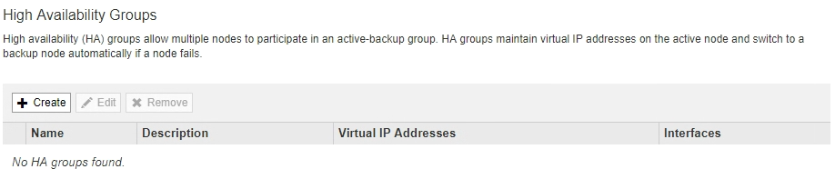
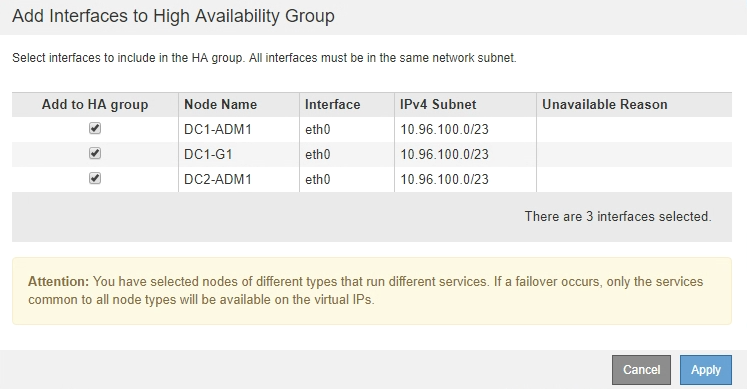

= 建立高可用度群組
:allow-uri-read: 
:icons: font
:imagesdir: ../media/

[role="lead"]
您可以建立一或多個高可用度（HA）群組、以提供對管理節點或閘道節點上服務的高可用度存取。

.您需要的產品
* 您必須使用支援的瀏覽器登入Grid Manager。
* 您必須具有「根存取」權限。

.關於這項工作
介面必須符合下列條件、才能納入HA群組：

* 介面必須用於閘道節點或管理節點。
* 介面必須屬於Grid Network（eth0）或Client Network（eth2）。
* 介面必須設定固定或靜態IP位址、而非使用DHCP。

.步驟
. 選擇*組態*>*網路設定*>*高可用度群組*。
+
此時會出現「高可用度群組」頁面。

+

. 按一下「 * 建立 * 」。
+
此時會出現Create High Availability Group（建立高可用度群組）對話方塊。

. 輸入HA群組的名稱、並視需要提供說明。
. 按一下「*選取介面*」。
+
此時會出現「新增介面至高可用度群組」對話方塊。下表列出合格的節點、介面和IPv4子網路。

+
image::../media/ha_group_add_interfaces.png[HA群組新增介面]

+
如果介面的IP位址是由DHCP指派、則該介面不會出現在清單中。

. 在「*新增至HA群組*」欄中、選取您要新增至HA群組之介面的核取方塊。
+
請注意下列選取介面的準則：

+
** 您必須選取至少一個介面。
** 如果您選取多個介面、則所有介面都必須位於Grid Network（eth0）或Client Network（eth2）上。
** 所有介面都必須位於同一個子網路中、或位於具有通用前置碼的子網路中。
+
IP位址將限制在最小的子網路（前置碼最大的子網路）。

** 如果您在不同類型的節點上選取介面、並發生容錯移轉、則虛擬IP上只會提供所選節點的通用服務。
+
*** 選取兩個以上的管理節點、以保護Grid Manager或租戶管理程式的HA。
*** 選取兩個以上的管理節點、閘道節點或兩者、以保護負載平衡器服務的HA。
*** 選取兩個以上的閘道節點、以提供CLB服務的HA保護。
+

NOTE: CLB服務已過時。

+

. 按一下「 * 套用 * 」。
+
您選取的介面會列在「建立高可用度群組」頁面的「介面」區段中。依預設、清單中的第一個介面會選取為「慣用主介面」。

+
image::../media/ha_group_select_virtual_ips.png[HA群組選取虛擬IP]

. 如果您想讓其他介面成為慣用的Master、請在*慣用Master*欄中選取該介面。
+
優先主介面為作用中介面、除非發生故障、導致VIP位址重新指派至備份介面。

+

NOTE: 如果HA群組可存取Grid Manager、則您必須在主要管理節點上選取一個介面、才能成為慣用的Master。部分維護程序只能從主要管理節點執行。

. 在頁面的「Virtual IP Addresses（虛擬IP位址）」區段中、輸入HA群組的一到十個虛擬IP位址。按一下加號（image:../media/icon_plus_sign_black_on_white_old.png["加號"]）以新增多個IP位址。
+
您必須至少提供一個IPV4位址。您也可以指定其他的IPv6位址。

+
所有成員介面共用的IPV4子網路中必須有IPV4位址。

. 按一下「 * 儲存 * 」。
+
HA群組隨即建立、您現在可以使用已設定的虛擬IP位址。

.相關資訊
link:../rhel/index.html["安裝Red Hat Enterprise Linux或CentOS"]

link:../vmware/index.html["安裝VMware"]

link:../ubuntu/index.html["安裝Ubuntu或DEBIAN"]

link:managing-load-balancing.html["管理負載平衡"]
