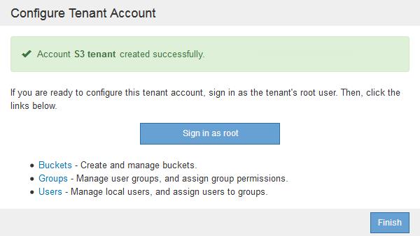

= 如果StorageGRID 無法使用SSO、請建立租戶帳戶
:allow-uri-read: 
:icons: font
:imagesdir: ../media/

[role="lead"]
當您建立租戶帳戶時、可以指定名稱、用戶端傳輸協定及儲存配額（選用）。如果StorageGRID 不使用單一登入（SSO）、您也必須指定租戶帳戶是否會使用自己的身分識別來源、並為租戶的本機root使用者設定初始密碼。

.關於這項工作
如果租戶帳戶將使用為Grid Manager設定的身分識別來源、而您想要將租戶帳戶的根存取權限授予聯盟群組、則必須將該聯盟群組匯入Grid Manager。您不需要將任何Grid Manager權限指派給此管理群組。請參閱的說明 link:managing-admin-groups.html["管理管理群組"]。

.步驟
. 在*顯示名稱*文字方塊中、輸入此租戶帳戶的顯示名稱。
+
顯示名稱不一定是唯一的。建立租戶帳戶時、會收到唯一的數字帳戶ID。

. 選擇此租戶帳戶將使用的用戶端傳輸協定、例如* S37*或* Swift。
. 對於S3租戶帳戶、除非您不想讓此租戶使用平台服務做為S3貯體、否則請保留「*允許平台服務*」核取方塊。
+
如果已啟用平台服務、租戶可以使用諸如CloudMirror複寫等功能來存取外部服務。您可能想要停用這些功能、以限制租戶使用的網路頻寬或其他資源量。請參閱「老舊平台服務」。

. 在「*儲存配額*」文字方塊中、選擇性地輸入您要讓此租戶物件使用的GB、TB或PB的最大數量。然後從下拉式清單中選取單位。
+
如果您希望此租戶擁有無限配額、請將此欄位留白。

+

NOTE: 租戶的儲存配額代表邏輯容量（物件大小）、而非實體容量（磁碟大小）。ILM複本和銷毀編碼不會影響使用的配額量。如果超過配額、租戶帳戶就無法建立新物件。

+

NOTE: 若要監控每個租戶帳戶的儲存使用量、請選取*使用量*。租戶帳戶也可以從租戶管理程式的儀表板或租戶管理API監控自己的儲存使用量。請注意、如果節點與網格中的其他節點隔離、租戶的儲存使用量值可能會過期。當網路連線恢復時、總計將會更新。

. 如果租戶將管理自己的群組和使用者、請遵循下列步驟。
+
.. 選取「*使用自己的身分識別來源*」核取方塊（預設）。
+

NOTE: 如果選取此核取方塊、且您想要將身分識別聯盟用於租戶群組和使用者、則租戶必須設定自己的身分識別來源。請參閱租戶帳戶使用說明。

.. 為租戶的本機root使用者指定密碼。

. 如果租戶將使用為Grid Manager設定的群組和使用者、請遵循下列步驟。
+
.. 取消選取「*使用自己的身分識別來源*」核取方塊。
.. 請執行下列任一或兩項操作：
+
*** 在根存取群組欄位中、從Grid Manager選取現有的聯盟群組、該群組應具有租戶的初始根存取權限。
+

NOTE: 如果您有足夠的權限、則當您按一下欄位時、會列出Grid Manager中現有的聯盟群組。否則、請輸入群組的唯一名稱。

*** 為租戶的本機root使用者指定密碼。

. 按一下「 * 儲存 * 」。
+
隨即建立租戶帳戶。

. 您也可以存取新租戶。否則、請前往的步驟 <<STEP_SIGN_IN_LATER,稍後存取租戶>>。
+
[cols="1a,2a"]
|===
| 如果您... | 執行此動作... 

 a| 
存取受限連接埠上的Grid Manager
 a| 
按一下*受限*以深入瞭解如何存取此租戶帳戶。

租戶管理程式的URL格式如下：

`https://_FQDN_or_Admin_Node_IP:port_/?accountId=_20-digit-account-id_/`

** `_FQDN_or_Admin_Node_IP_` 是管理節點的完整網域名稱或IP位址
** `_port_` 為租戶專用連接埠
** `_20-digit-account-id_` 是租戶的唯一帳戶ID

 a| 
存取連接埠443上的Grid Manager、但您未設定本機root使用者的密碼
 a| 
按一下「*登入*」、然後在「根存取」聯盟群組中輸入使用者的認證資料。

 a| 
存取連接埠443上的Grid Manager、然後為本機root使用者設定密碼
 a| 
請前往下一個步驟 <<STEP_SIGN_IN_AS_ROOT,以root登入>>。

|===
. [[d步驟_sign_in_as根目錄]]以root身分登入租戶：
+
.. 在「設定租戶帳戶」對話方塊中、按一下「*以root登入*」按鈕。
+

+
按鈕上會出現綠色核取符號、表示您現在已以root使用者身分登入租戶帳戶。

+
image::../media/step_2_sign_in_as_root.gif[以root登入]

.. 按一下連結以設定租戶帳戶。
+
每個連結都會在租戶管理程式中開啟對應的頁面。若要完成此頁面、請參閱租戶帳戶使用說明。

.. 單擊*完成*。

. [[section_Sign_in_lapp]若要稍後存取租戶：
+
[cols="1a,2a"]
|===
| 如果您使用... | 請執行下列其中一項... 

 a| 
連接埠443
 a| 
** 從Grid Manager中選取*租戶*、然後按一下租戶名稱右側的*登入*。
** 在網頁瀏覽器中輸入租戶的URL：
+
`https://_FQDN_or_Admin_Node_IP_/?accountId=_20-digit-account-id_/`

+
*** `_FQDN_or_Admin_Node_IP_` 是管理節點的完整網域名稱或IP位址
*** `_20-digit-account-id_` 是租戶的唯一帳戶ID

 a| 
受限連接埠
 a| 
** 從Grid Manager中選取*租戶*、然後按一下*受限*。
** 在網頁瀏覽器中輸入租戶的URL：
+
`https://_FQDN_or_Admin_Node_IP:port_/?accountId=_20-digit-account-id_`

+
*** `_FQDN_or_Admin_Node_IP_` 是管理節點的完整網域名稱或IP位址
*** `_port_` 為租戶專用的受限連接埠
*** `_20-digit-account-id_` 是租戶的唯一帳戶ID

|===

.相關資訊
link:controlling-access-through-firewalls.html["透過防火牆控制存取"]

link:managing-platform-services-for-s3-tenant-accounts.html["管理S3租戶帳戶的平台服務"]

link:../tenant/index.html["使用租戶帳戶"]
