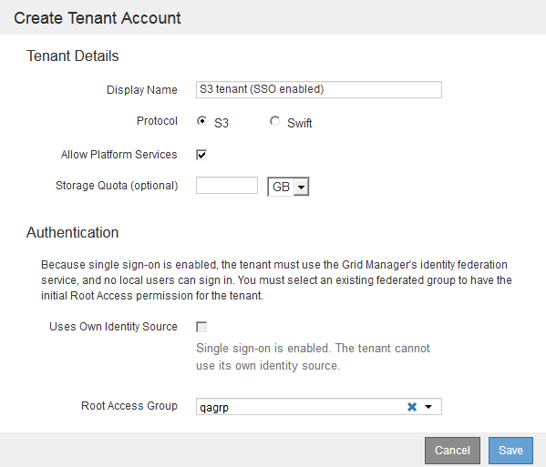

= 建立租戶帳戶
:allow-uri-read: 
:icons: font
:imagesdir: ../media/

[role="lead"]
您必須建立至少一個租戶帳戶、以控制StorageGRID 對您的作業系統儲存設備的存取。

.您需要的產品
* 您必須使用支援的瀏覽器登入Grid Manager。
* 您必須擁有特定的存取權限。

.步驟
. 選取*租戶*。
+
此時會出現「租戶帳戶」頁面、並列出任何現有的租戶帳戶。

+
image::../media/tenant_accounts_page_blank.png[租戶帳戶頁面-空白]

. 選擇* Create *（建立*）。
+
隨即顯示「Create Tenant Account（建立租戶帳戶）」頁頁面中包含的欄位取決於StorageGRID 是否已針對該系統啟用單一登入（SSO）。

+
** 如果未使用SSO、則「建立租戶帳戶」頁面看起來就像這樣。
+
image::../media/create_tenant_account_no_sso.gif[已停用建立租戶帳戶SSO]

** 如果啟用SSO、「建立租戶帳戶」頁面就會顯示如下。
+

.相關資訊
link:using-identity-federation.html["使用身分識別聯盟"]

link:configuring-sso.html["設定單一登入"]
