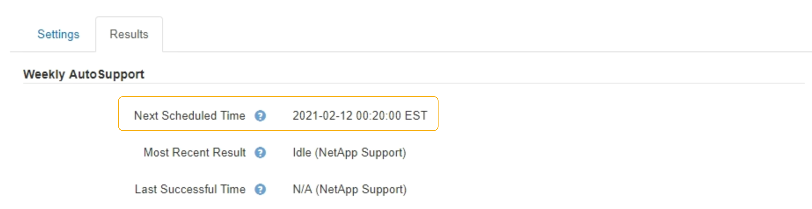

= 停用每週AutoSupport 更新訊息
:allow-uri-read: 
:icons: font
:imagesdir: ../media/

[role="lead"]
根據預設StorageGRID 、將支援系統設定為每AutoSupport 週傳送一次消息給NetApp Support。

.您需要的產品
* 您必須使用支援的瀏覽器登入Grid Manager。
* 您必須具有「根存取」或「其他網格組態」權限。

.關於這項工作
若要判斷每週AutoSupport 更新訊息的傳送時間、請參閱AutoSupport * AutoSupport 《*》*《*結果*》頁面*《*每週更新*》下的*《下一排程時間*》。 

您可以隨時停用AutoSupport 自動傳送功能。

.步驟
. 選取*支援*>*工具*>* AutoSupport 參考*。
+
畫面上會出現「*設定*」索引標籤、並已選取此索引標籤。AutoSupport

. 清除*啟用每週AutoSupport 資訊*核取方塊。
+
image::../media/autosupport_disable_weekly.png[頁面AutoSupport]

. 選擇*保存*。

