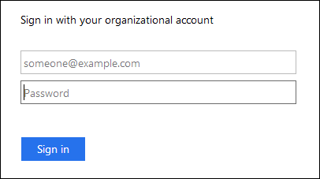

= 單一登入的運作方式
:allow-uri-read: 
:icons: font
:imagesdir: ../media/

[role="lead"]
在啟用單一登入（SSO）之前、請先檢閱StorageGRID 啟用SSO時、哪些地方會影響到「資訊登入」和「登出」程序。

== 啟用SSO時登入

啟用SSO並登入StorageGRID 支援功能時、系統會將您重新導向至組織的SSO頁面、以驗證您的認證資料。

.步驟
. 在StorageGRID 網頁瀏覽器中輸入任何「靜態管理節點」的完整網域名稱或IP位址。
+
畫面上會出現「簽署」頁面。StorageGRID

+
** 如果這是您第一次存取此瀏覽器上的URL、系統會提示您輸入帳戶ID：
+
image::../media/sso_sign_in_first_time.gif[使用啟用SSO的第一次存取權限登入]

** 如果您先前曾存取Grid Manager或Tenant Manager、系統會提示您選擇最近的帳戶或輸入帳戶ID：
+
image::../media/sign_in_sso.gif[啟用SSO時顯示「登入」頁面StorageGRID]

+

NOTE: 輸入租戶帳戶的完整URL（即完整網域名稱或IP位址之後）時、不會顯示「協助登入」頁面StorageGRID `/?accountId=_20-digit-account-id_`）。而是會立即重新導向至組織的SSO登入頁面、您可以在其中登入 <<signin_sso,使用SSO認證登入>>。

. 指出您要存取Grid Manager或租戶管理程式：
+
** 若要存取Grid Manager、請將「**帳戶ID」欄位保留空白、輸入* 0*作為帳戶ID、或選取* Grid Manager*（若出現在最近的帳戶清單中）。
** 若要存取租戶管理程式、請輸入20位數的租戶帳戶ID、或是在最近的帳戶清單中、依名稱選取租戶。

. 按一下*登入*
+
可將您重新導向至組織的SSO登入頁面。StorageGRID例如：

+

. [[signin_SSO ]使用您的SSO認證登入。
+
如果SSO認證資料正確：

+
.. 身分識別供應商（IDP）提供驗證回應StorageGRID 功能以回應功能。
.. 驗證驗證回應。StorageGRID
.. 如果回應有效、且您屬於具有足夠存取權限的聯盟群組、您將會登入Grid Manager或租戶管理程式、視您選取的帳戶而定。

. 您也可以存取其他管理節點、或是存取Grid Manager或租戶管理程式（如果您有足夠的權限）。
+
您不需要重新輸入SSO認證。

== 啟用SSO時登出

啟用SSO以StorageGRID 利執行功能時、登出時會發生什麼事取決於您登入的項目、以及登出的位置。

.步驟
. 在使用者介面的右上角找到*登出*連結。
. 按一下*登出*。
+
畫面上會出現「簽署」頁面。StorageGRID「*最近的帳戶*」下拉式清單會更新為包含* Grid Manager*或租戶名稱、以便日後更快存取這些使用者介面。

+
[cols="1a,1a,1a"]
|===
| 如果您已登入... | 您也可以登出... | 您已登出... 

 a| 
一個或多個管理節點上的Grid Manager
 a| 
任何管理節點上的Grid Manager
 a| 
所有管理節點上的Grid Manager

 a| 
一或多個管理節點上的租戶管理程式
 a| 
任何管理節點上的租戶管理程式
 a| 
所有管理節點上的租戶管理程式

 a| 
Grid Manager與租戶管理程式
 a| 
網格管理程式
 a| 
僅限Grid Manager。您也必須登出租戶管理程式、才能登出SSO。

 a| 
租戶管理程式
 a| 
僅限租戶管理程式。您也必須登出Grid Manager、才能登出SSO。

|===

NOTE: 下表摘要說明當您使用單一瀏覽器工作階段登出時會發生的情況。如果您在StorageGRID 多個瀏覽器工作階段之間登入到Sof、則必須分別登出所有瀏覽器工作階段。
