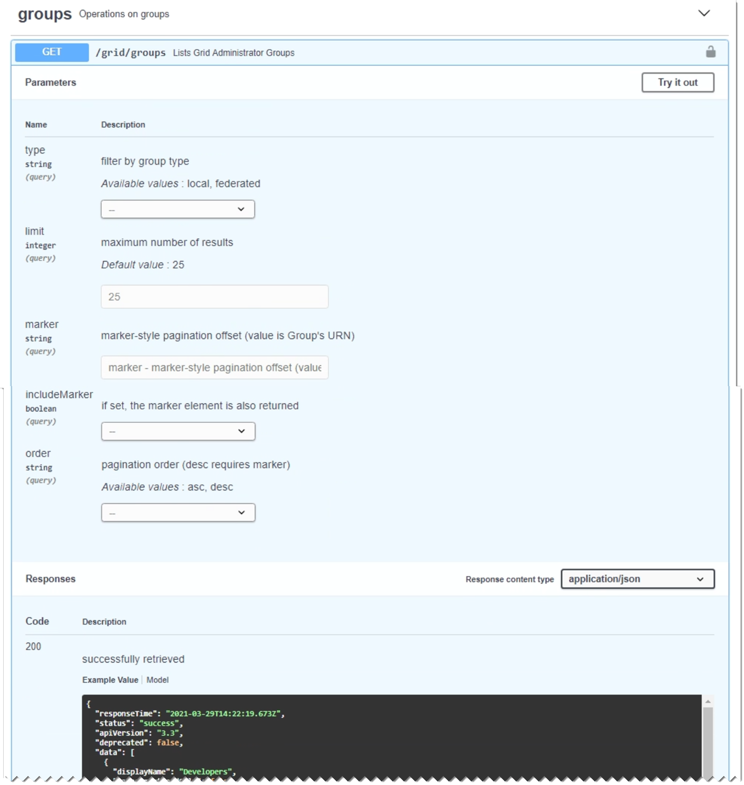

= 發出API要求
:allow-uri-read: 
:icons: font
:imagesdir: ../media/

[role="lead"]
Swagger使用者介面提供每個API作業的完整詳細資料和文件。

.您需要的產品
* 您必須使用支援的瀏覽器登入Grid Manager。
* 您必須擁有特定的存取權限。

IMPORTANT: 您使用API文件網頁執行的任何API作業都是即時作業。請小心不要錯誤地建立、更新或刪除組態資料或其他資料。

.步驟
. 從Grid Manager標頭中選擇* Help*>* API Documentation *。
. 選取所需的作業。
+
展開API作業時、您可以看到可用的HTTP動作、例如GET、PUT、update和DELETE。

. 選取HTTP動作以查看申請詳細資料、包括端點URL、任何必要或選用參數的清單、申請本文的範例（視需要）、以及可能的回應。
+

. 判斷要求是否需要其他參數、例如群組或使用者ID。然後取得這些值。您可能需要先發出不同的API要求、才能取得所需的資訊。
. 判斷您是否需要修改範例要求本文。如果是、您可以按一下*模型*來瞭解每個欄位的需求。
. 按一下*試用*。
. 提供任何必要的參數、或視需要修改申請本文。
. 按一下*執行*。
. 檢閱回應代碼以判斷要求是否成功。

