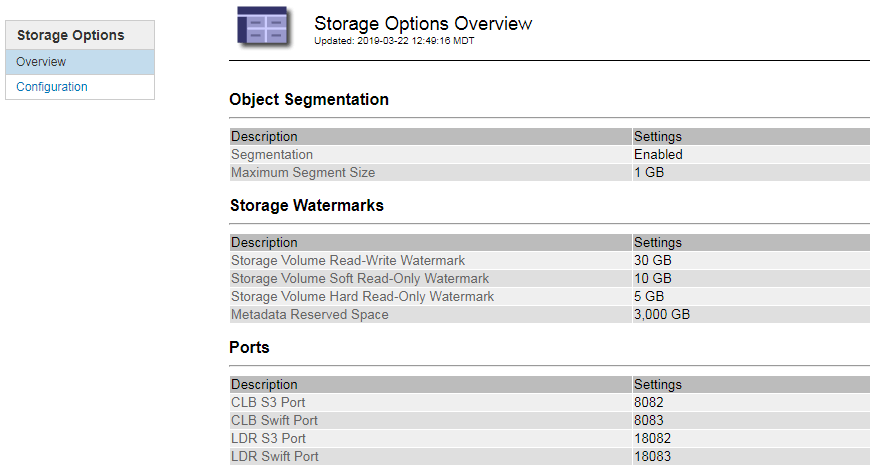

= 管理儲存選項
:allow-uri-read: 
:icons: font
:imagesdir: ../media/

[role="lead"]
您可以使用Grid Manager中的組態功能表來檢視及設定儲存選項。儲存選項包括物件分割設定和儲存浮點的目前值。您也可以檢視閘道節點上已過時的CLB服務所使用的S3和Swift連接埠、以及儲存節點上的LDR服務所使用的連接埠。

如需連接埠指派的相關資訊、請參閱 link:summary-ip-addresses-and-ports-for-client-connections.html["摘要：用於用戶端連線的IP位址和連接埠"]。

