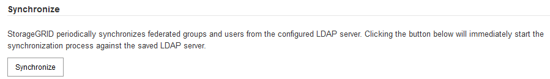

= 使用身分識別聯盟
:allow-uri-read: 
:icons: font
:imagesdir: ../media/

[role="lead"]
使用身分識別聯盟可更快設定群組和使用者、並讓使用者StorageGRID 使用熟悉的認證登入到這個功能。

== 設定身分識別聯盟

如果您想要在另一個系統（例如Active Directory、OpenLDAP或Oracle Directory Server）中管理管理系統群組和使用者、可以設定身分識別聯盟。

.您需要的產品
* 您必須使用支援的瀏覽器登入Grid Manager。
* 您必須擁有特定的存取權限。
* 如果您打算啟用單一登入（SSO）、則必須使用Active Directory做為聯盟身分識別來源、使用AD FS做為身分識別供應商。請參閱「使用單一登入的要求」。
* 您必須使用Active Directory、OpenLDAP或Oracle Directory Server做為身分識別供應商。
+

NOTE: 如果您要使用未列出的LDAP v3服務、則必須聯絡技術支援部門。

* 如果您打算使用傳輸層安全性（TLS）與LDAP伺服器進行通訊、則身分識別供應商必須使用TLS 1.2或1.3。

.關於這項工作
若要匯入下列類型的聯盟群組、您必須為Grid Manager設定身分識別來源：

* 系統管理群組：管理群組中的使用者可以登入Grid Manager、並根據指派給群組的管理權限來執行工作。
* 租戶使用者群組、適用於不使用自己身分識別來源的租戶。租戶群組中的使用者可以登入租戶管理程式、並根據在租戶管理程式中指派給群組的權限來執行工作。

.步驟
. 選擇*組態*>*存取控制*>*身分識別聯盟*。
. 選取*啟用身分識別聯盟*。
+
此時會顯示用於設定LDAP伺服器的欄位。

. 在LDAP服務類型區段中、選取您要設定的LDAP服務類型。
+
您可以選擇* Active Directory *、* OpenLDAP*或*其他*。

+

NOTE: 如果選擇* OpenLDAP*、則必須設定OpenLDAP伺服器。請參閱OpenLDAP伺服器設定指南。

+

NOTE: 選擇*其他*以設定使用Oracle Directory Server的LDAP伺服器值。

. 如果選擇*其他*、請填寫「LDAP屬性」區段中的欄位。
+
** *使用者唯一名稱*：含有LDAP使用者唯一識別碼的屬性名稱。此屬性相當於 `sAMAccountName` 適用於Active Directory和 `uid` 適用於OpenLDAP。如果您要設定Oracle Directory Server、請輸入 `uid`。
** *使用者UUID *：含有LDAP使用者永久唯一識別碼的屬性名稱。此屬性相當於 `objectGUID` 適用於Active Directory和 `entryUUID` 適用於OpenLDAP。如果您要設定Oracle Directory Server、請輸入 `nsuniqueid`。指定屬性的每個使用者值必須是16位元組或字串格式的32位數十六進位數字、連字號會被忽略。
** *群組唯一名稱*：包含LDAP群組唯一識別碼的屬性名稱。此屬性相當於 `sAMAccountName` 適用於Active Directory和 `cn` 適用於OpenLDAP。如果您要設定Oracle Directory Server、請輸入 `cn`。
** *群組UUID *：包含LDAP群組永久唯一識別碼的屬性名稱。此屬性相當於 `objectGUID` 適用於Active Directory和 `entryUUID` 適用於OpenLDAP。如果您要設定Oracle Directory Server、請輸入 `nsuniqueid`。指定屬性的每個群組值必須是16位元組或字串格式的32位數十六進位數字、連字號會被忽略。

. 在「Configure LDAP server（設定LDAP伺服器）」區段中、輸入所需的LDAP伺服器和網路連線資訊。
+
** *主機名稱*：LDAP伺服器的伺服器主機名稱或IP位址。
** *連接埠*：用於連接LDAP伺服器的連接埠。
+

NOTE: STARTTLS的預設連接埠為389、LDAPS的預設連接埠為636。不過、只要防火牆設定正確、您就可以使用任何連接埠。

** *使用者名稱*：將連線至LDAP伺服器之使用者的辨別名稱（DN）完整路徑。
+

NOTE: 對於Active Directory、您也可以指定低層級的登入名稱或使用者主要名稱。

+
指定的使用者必須擁有列出群組和使用者的權限、並可存取下列屬性：

+
*** `sAMAccountName` 或 `uid`
*** `objectGUID`、 `entryUUID`或 `nsuniqueid`
*** `cn`
*** `memberOf` 或 `isMemberOf`

** *密碼*：與使用者名稱相關的密碼。
** *群組基礎DN*：您要搜尋群組之LDAP子樹狀結構的辨別名稱（DN）完整路徑。在Active Directory範例（如下）中、識別名稱相對於基礎DN（DC=storagegRID、DC=example、DC=com）的所有群組均可做為聯盟群組使用。
+

NOTE: 「群組唯一名稱*」值必須在所屬的*群組基礎DN*中是唯一的。

** *使用者基礎DN*：您要搜尋使用者之LDAP子樹狀目錄的辨別名稱（DN）完整路徑。
+

NOTE: *使用者唯一名稱*值必須在其所屬的*使用者基礎DN*內是唯一的。

. 在*傳輸層安全性（TLS）*區段中、選取安全性設定。
+
** *使用ARTTLS（建議使用）*：使用ARTTLS來保護與LDAP伺服器的通訊安全。這是建議的選項。
** *使用LDAPS*：LDAPS（LDAP over SSL）選項使用TLS建立與LDAP伺服器的連線。基於相容性考量、支援此選項。
** *請勿使用TLS*：StorageGRID 不保護介於整個系統與LDAP伺服器之間的網路流量。
+

NOTE: 如果Active Directory伺服器強制執行LDAP簽署、則不支援使用*「不使用TLS*」選項。您必須使用ARTTLS或LDAPS。

. 如果您選取了ARTTLS或LDAPS、請選擇用來保護連線安全的憑證。
+
** *使用作業系統CA憑證*：使用作業系統上安裝的預設CA憑證來保護連線安全。
** *使用自訂CA憑證*：使用自訂安全性憑證。
+
如果選取此設定、請將自訂安全性憑證複製並貼到CA憑證文字方塊中。

. 或者、選取*測試連線*來驗證LDAP伺服器的連線設定。
+
如果連線有效、頁面右上角會出現確認訊息。

. 如果連線有效、請選取*儲存*。
+
下列螢幕擷取畫面顯示使用Active Directory之LDAP伺服器的組態值範例。

+
image::../media/ldap_config_active_directory.png[Identity Federation頁面顯示使用Active Directory的LDAP伺服器]

.相關資訊
link:supported-ciphers-for-outgoing-tls-connections.html["用於傳出TLS連線的支援密碼"]

link:requirements-for-sso.html["使用單一登入的需求"]

link:creating-tenant-account.html["建立租戶帳戶"]

link:../tenant/index.html["使用租戶帳戶"]

=== 設定OpenLDAP伺服器的準則

如果您要使用OpenLDAP伺服器進行身分識別聯盟、則必須在OpenLDAP伺服器上設定特定設定。

==== memberOf和refert覆疊

應啟用memberof和refert覆疊。如需詳細資訊、請參閱OpenLDAP管理員指南中的反轉群組成員資格維護說明。

==== 索引

您必須使用指定的索引關鍵字來設定下列OpenLDAP屬性：

* `olcDbIndex: objectClass eq`
* `olcDbIndex: uid eq,pres,sub`
* `olcDbIndex: cn eq,pres,sub`
* `olcDbIndex: entryUUID eq`

此外、請確定使用者名稱說明中所述的欄位已建立索引、以獲得最佳效能。

請參閱OpenLDAP系統管理員指南中有關反轉群組成員資格維護的資訊。

.相關資訊
http://www.openldap.org/doc/admin24/index.html["OpenLDAP文件：2.4版管理員指南"^]

== 強制與身分識別來源同步

此系統會定期同步來自身分識別來源的聯盟群組和使用者。StorageGRID如果您想要盡快啟用或限制使用者權限、可以強制啟動同步。

.您需要的產品
* 您必須使用支援的瀏覽器登入Grid Manager。
* 您必須擁有特定的存取權限。
* 必須啟用身分識別來源。

.步驟
. 選擇*組態*>*存取控制*>*身分識別聯盟*。
+
此時會出現「身分識別聯盟」頁面。「*同步處理*」按鈕位於頁面底部。

+

. 單擊* Synchronize*。
+
確認訊息表示同步已成功啟動。視您的環境而定、同步處理程序可能需要一些時間。

+

NOTE: 如果同步處理來自身分識別來源的聯盟群組和使用者時發生問題、則會觸發*身分識別聯盟同步處理失敗*警示。

== 停用身分識別聯盟

您可以暫時或永久停用群組和使用者的身分識別聯盟。停用身分識別聯盟時StorageGRID 、不會在驗證和身分識別來源之間進行通訊。不過、您已設定的任何設定都會保留下來、讓您日後可以輕鬆重新啟用身分識別聯盟。

.您需要的產品
* 您必須使用支援的瀏覽器登入Grid Manager。
* 您必須擁有特定的存取權限。

.關於這項工作
在停用身分識別聯盟之前、您應注意下列事項：

* 聯盟使用者將無法登入。
* 目前已登入的聯盟使用者將在StorageGRID 其工作階段過期之前保留對此系統的存取權、但在工作階段過期後仍無法登入。
* 不會在不同步系統與身分識別來源之間進行同步、StorageGRID 也不會針對尚未同步的帳戶發出警示或警示。
* 如果單一登入（SSO）設定為*已啟用*或*沙箱模式*、則「*啟用身分聯盟*」核取方塊會停用。「單一登入」頁面的SSO狀態必須為*停用*、才能停用身分識別聯盟。

.步驟
. 選擇*組態*>*存取控制*>*身分識別聯盟*。
. 取消核取「*啟用身分識別聯盟*」核取方塊。
. 按一下「 * 儲存 * 」。

.相關資訊
link:disabling-single-sign-on.html["停用單一登入"]
