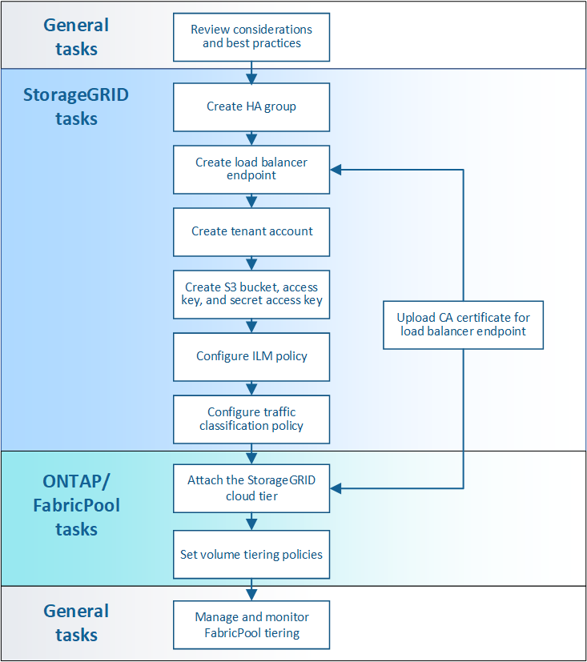

= 設定StorageGRID 支援FabricPool 功能的支援
:allow-uri-read: 
:icons: font
:imagesdir: ../media/

[role="lead"]
如果您使用NetApp ONTAP 功能性軟體、可以使用NetApp FabricPool 功能將非使用中或冷的資料分層到NetApp StorageGRID 的物件式儲存系統。

請依照下列指示：

* 取得有關設定StorageGRID 搭配FabricPool 使用的物件儲存系統的總覽。
* 瞭解ONTAP 如何在將StorageGRID 下列資訊附加到作FabricPool 爲一個名爲「不知如何」的地方時、獲得您提供給「不知如何」的資訊。
* 瞭解最佳實務做法、以設定StorageGRID 適用於StorageGRID 整個流程的資訊生命週期管理（ILM）原則、一套適用於StorageGRID 整個流程的資訊流量分類原則、以及其他適用於FabricPool 整個流程的功能。

.您需要的產品
使用這些指示之前：

* 決定您FabricPool 要使用哪個「功能區」分層原則、將非作用中ONTAP 的功能區資料分層到StorageGRID 無法使用的地方。
* 規劃並安裝StorageGRID 一套可滿足儲存容量和效能需求的功能完善的系統。
* 熟悉StorageGRID 包括Grid Manager和Tenant Manager在內的整個系統軟體。

.相關資訊
* https://["TR-4598：FabricPool 《關於解決方案的最佳實務做法ONTAP 》（英文）"^]
* https://["供應說明文件中心 ONTAP"^]

== 什麼是呢FabricPool

VMware是一套不間斷的混合式儲存解決方案、使用高效能Flash Aggregate做為效能層、而物件存放區則做為雲端層。FabricPool ONTAP根據資料是否經常存取、將資料儲存在階層中FabricPool 。使用VMware解決方案有助於降低儲存成本、而不會影響效能、效率或保護。FabricPool

無需變更架構、您也可以從中央ONTAP 的資訊儲存系統繼續管理資料庫和應用程式環境。

== 什麼是物件儲存設備

物件儲存是一種儲存架構、與其他儲存架構（例如檔案或區塊儲存）相比、它能將資料當作物件來管理。物件會保留在單一容器（例如儲存區）內、不會以檔案形式嵌套在其他目錄內的目錄內。雖然物件儲存設備的效能通常低於檔案或區塊儲存設備、但可大幅擴充。此資料儲存庫可容納PB的資料StorageGRID 。

== 將市場資料用作不實的雲端層FabricPool StorageGRID

可將各種資料分層保存至許多物件儲存供應商、FabricPool ONTAP StorageGRID 包括公有雲可能會在庫位或容器層級設定每秒支援的輸入/輸出作業（IOPS）數量上限、但StorageGRID 不像公有雲、效能會隨系統中的節點數量而擴充。使用VMware做為VMware的雲端層、您可以將冷資料保留在私有雲端、以獲得最高效能、並完全掌控資料。StorageGRID FabricPool

此外FabricPool 、當StorageGRID 您使用效益技術做為雲端層時、不需要使用不含功能的認證。

== 搭配ONTAP 使用多個支援StorageGRID 功能的支援功能

這些指示說明如何將StorageGRID 資訊鏈接到ONTAP 單一的資訊叢集。不過、您可能想要將相同StorageGRID 的支援系統連接至多ONTAP 個支援叢集。

從多ONTAP 個支援叢集將資料分層至單StorageGRID 一支援系統的唯一需求、是每個叢集都必須使用不同的S3儲存區。根據您的需求、您可以針對所有叢集使用相同的高可用度（HA）群組、負載平衡器端點和租戶帳戶、也可以針對每個叢集設定每個項目。
