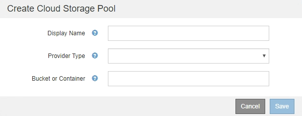

= 建立雲端儲存資源池
:allow-uri-read: 
:icons: font
:imagesdir: ../media/

[role="lead"]
當您建立Cloud Storage Pool時、請指定StorageGRID 外部儲存區或Container的名稱和位置、以供用來儲存物件、雲端供應商類型（Amazon S3或Azure Blob Storage）、StorageGRID 以及存取外部儲存區或容器所需的資訊。

.您需要的產品
* 您必須使用支援的瀏覽器登入Grid Manager。
* 您必須擁有特定的存取權限。
* 您必須已檢閱雲端儲存資源池的設定準則。
* Cloud Storage Pool所參照的外部儲存區或容器必須存在。
* 您必須擁有存取儲存區或容器所需的所有驗證資訊。

.關於這項工作
Cloud Storage Pool會指定單一外部S3儲存區或Azure Blob儲存容器。一旦儲存雲端儲存資源池、即可驗證其運作、因此您必須確保Cloud Storage Pool中指定的儲存庫或容器存在且可存取。StorageGRID

.步驟
. 選擇* ILM *>* Storage Pools*。
+
此時將出現「儲存資源池」頁面。本頁包含兩個區段：儲存資源池和雲端儲存資源池。

+
image::../media/storage_pools_page_cloud_storage_pool.png[儲存資源池頁面雲端儲存資源池]

. 在頁面的「雲端儲存資源池」區段中、按一下「*建立*」。
+
隨即顯示Create Cloud Storage Pool（建立雲端儲存池）對話方塊。

+

. 輸入下列資訊：
+
[cols="1a,2a"]
|===
| 欄位 | 說明 

 a| 
顯示名稱
 a| 
簡短說明雲端儲存資源池及其用途的名稱。設定ILM規則時、請使用容易識別的名稱。

 a| 
供應商類型
 a| 
您將使用哪家雲端供應商來管理此雲端儲存資源池：

** Amazon S3（針對S3或C2S S3雲端儲存資源池選取此選項）
** Azure Blob儲存設備

*附註：*當您選取供應商類型時、頁面底部會出現「服務端點」、「驗證」和「伺服器驗證」等區段。

 a| 
貯體或Container
 a| 
為雲端儲存池建立的外部S3儲存區或Azure容器名稱。您在此指定的名稱必須與儲存區或容器名稱完全相符、否則建立雲端儲存池將會失敗。儲存雲端儲存資源池後、您無法變更此值。

|===
. 根據所選的供應商類型、完成頁面的「服務端點」、「驗證」和「伺服器驗證」區段。
+
** link:s3-authentication-details-for-cloud-storage-pool.html["S3：指定雲端儲存資源池的驗證詳細資料"]
** link:c2s-s3-authentication-details-for-cloud-storage-pool.html["C2S S3：指定雲端儲存資源池的驗證詳細資料"]
** link:azure-authentication-details-for-cloud-storage-pool.html["Azure：指定雲端儲存資源池的驗證詳細資料"]

