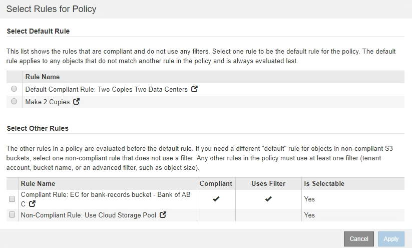
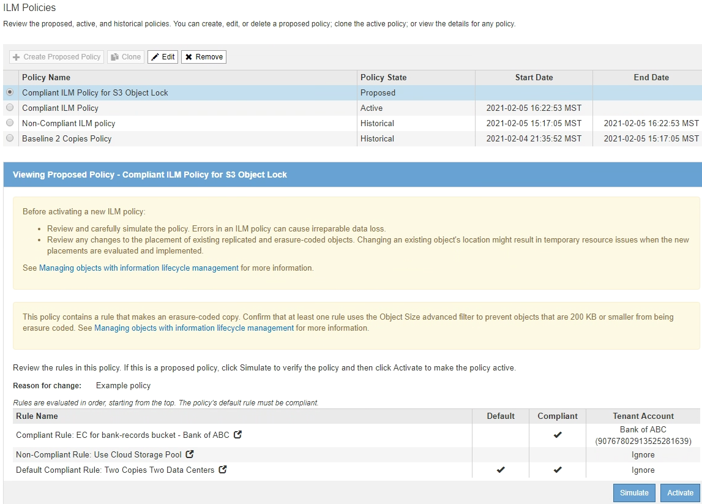

= 在啟用S3物件鎖定之後建立ILM原則
:allow-uri-read: 
:icons: font
:imagesdir: ../media/

[role="lead"]
如果已啟用全域S3物件鎖定設定、則建立原則的步驟會略有不同。您必須確保ILM原則符合已啟用S3物件鎖定的儲存區需求。

.您需要的產品
* 您必須使用支援的瀏覽器登入Grid Manager。
* 您必須擁有特定的存取權限。
* 必須已啟用StorageGRID 整個S3物件鎖定設定、才能使用此功能。
+
[NOTE]
====
如果尚未啟用全域S3物件鎖定設定、請改用一般指示來建立建議的原則。

link:creating-proposed-ilm-policy.html["建立建議的ILM原則"]

====
* 您必須建立相容且不相容的ILM規則、以新增至建議的原則。視需要、您可以儲存建議的原則、建立其他規則、然後編輯建議的原則以新增規則。
+
link:example-7-compliant-ilm-policy-for-s3-object-lock.html["範例7：S3物件鎖定的符合ILM原則"]

* 您必須為原則建立相容的預設ILM規則。
+
link:creating-default-ilm-rule.html["建立預設ILM規則"]

.步驟
. 選擇* ILM *>* Policies *。
+
此時將顯示ILM Policies（ILM策略）頁面。如果已啟用全域S3物件鎖定設定、則「ILM原則」頁面會指出哪些ILM規則符合規定。

+
image::../media/ilm_policies_page_compliant.png[符合ILM原則頁面]

. 在「*名稱*」欄位中輸入建議原則的唯一名稱。
+
您必須輸入至少1個字元、且不得超過64個字元。

. 在「*變更理由*」欄位中輸入您建立新建議原則的原因。
+
您必須輸入至少1個字元、且不得超過128個字元。

. 若要新增規則至原則、請選取*選取規則*。
+
此時會出現「選取原則規則」對話方塊、其中列出所有已定義的規則。

+
** 「選取預設規則」區段會列出可作為相容原則預設的規則。其中包含不使用篩選器的符合法規。
** 「選取其他規則」區段會列出可為此原則選取的其他相容和不相容規則。

. 選取規則名稱或「更多詳細資料」圖示  可查看該規則的設置。
. 在「*選取預設規則*」區段中、為建議的原則選取一個預設規則。
+
本節中的表格僅列出符合且不使用任何篩選器的規則。

+
[NOTE]
====
如果「選取預設規則」區段中未列出任何規則、您必須結束ILM原則頁面、然後建立符合法規的預設規則。

link:creating-default-ilm-rule.html["建立預設ILM規則"]

====
+

IMPORTANT: 請勿使用「製作2份複本」常用規則做為原則的預設規則。「製作2份複本」規則使用單一儲存資源池「所有儲存節點」、其中包含所有站台。如果您使用此規則、一個物件的多個複本可能會放置在同一個站台上。

. 在「*選取其他規則*」區段中、選取您要納入原則的任何其他規則。
+
.. 如果您需要針對不相容S3儲存區中的物件使用不同的「預設」規則、請選擇不使用篩選器的不符合規定的規則。
+
例如、您可能想要使用Cloud Storage Pool或歸檔節點、將物件儲存在未啟用S3物件鎖定的儲存區中。

+

NOTE: 您只能選取一個不符合規定的規則、而不使用篩選器。只要您選取一條規則、*可選取*欄就會顯示*否*、表示任何其他不符合規定的規則沒有篩選器。

.. 選取您要在原則中使用的任何其他相容或不相容的規則。
+
其他規則必須至少使用一個篩選器（租戶帳戶、庫位名稱或進階篩選器、例如物件大小）。

. 選取完規則後、請選取*「Apply」（套用）*。
+
此時會列出您選取的規則。預設規則結尾為、其上方則為其他規則。如果您也選取不符合規定的「預設」規則、則該規則會新增為原則中的第二到最後一條規則。

+
在此範例中、最後一條規則是2份複本2個資料中心、預設規則是：它符合法規、而且沒有篩選條件。倒數第二規則雲端儲存資源池也沒有篩選條件、但不符合法規要求。

+
image::../media/ilm_policies_selected_rules_compliant.png[符合ILM原則所選規則]

+
。

. 拖放非預設規則的列、以決定評估這些規則的順序。
+
您無法移動預設規則或不相容的「預設」規則。

+

IMPORTANT: 您必須確認ILM規則的順序正確。當原則啟動時、新物件和現有物件會依照列出的順序進行評估、從上方開始。

. 視需要按一下刪除圖示 image:../media/icon_nms_delete_new.gif["刪除圖示"] 若要刪除原則中不想要的任何規則、或選取*選取規則*以新增更多規則。
. 完成後、請選取*「Save（儲存）」*。
+
ILM Policies（ILM原則）頁面隨即更新：

+
** 您儲存的原則會顯示為「建議」。建議的原則沒有開始和結束日期。
** 將啟用*模擬*和*啟動*按鈕。

. 前往 link:simulating-ilm-policy.html["模擬ILM原則"]。

