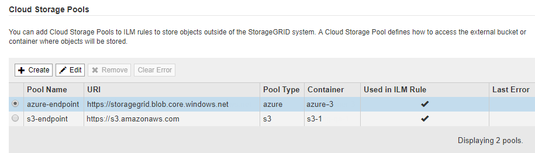

= 編輯雲端儲存資源池
:allow-uri-read: 
:icons: font
:imagesdir: ../media/

[role="lead"]
您可以編輯Cloud Storage Pool來變更其名稱、服務端點或其他詳細資料、但是您無法變更Cloud Storage Pool的S3儲存區或Azure容器。

.您需要的產品
* 您必須使用支援的瀏覽器登入Grid Manager。
* 您必須擁有特定的存取權限。
* 您必須已檢閱雲端儲存資源池的設定準則。

.步驟
. 選擇* ILM *>* Storage Pools*。
+
此時將出現「儲存資源池」頁面。Cloud Storage Pools表格會列出現有的Cloud Storage Pools。

+

. 選取您要編輯之雲端儲存資源池的選項按鈕。
. 按一下 * 編輯 * 。
. 視需要變更顯示名稱、服務端點、驗證認證或憑證驗證方法。
+

IMPORTANT: 您無法變更雲端儲存資源池的供應商類型、S3儲存區或Azure容器。

+
如果您先前上傳了伺服器或用戶端憑證、可以選取*檢視目前*來檢閱目前使用的憑證。

. 按一下「 * 儲存 * 」。
+
當您儲存雲端儲存資源池時StorageGRID 、驗證資源桶或容器及服務端點是否存在、以及是否可以使用您指定的認證資料來存取。

+
如果Cloud Storage Pool驗證失敗、則會顯示錯誤訊息。例如、如果發生憑證錯誤、可能會報告錯誤。

+
請參閱疑難排解Cloud Storage Pool的指示、解決問題、然後再次嘗試儲存Cloud Storage Pool。

.相關資訊
link:considerations-for-cloud-storage-pools.html["雲端儲存資源池的考量"]

link:troubleshooting-cloud-storage-pools.html["疑難排解雲端儲存資源池"]
