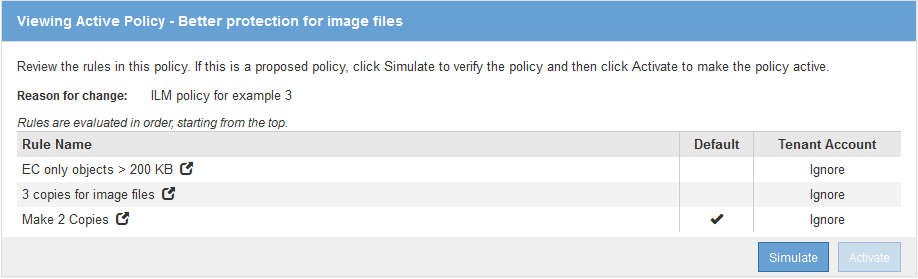

= 範例3：ILM規則與原則、可更有效保護映像檔案
:allow-uri-read: 
:icons: font
:imagesdir: ../media/

[role="lead"]
您可以使用下列範例規則和原則、確保大於200 KB的影像已進行銷毀編碼、並由較小的影像製作三個複本。

CAUTION: 下列ILM規則和原則僅為範例。有許多方法可以設定ILM規則。在啟動新原則之前、請先模擬建議的原則、確認其運作方式符合保護內容免於遺失的目的。

== ILM規則1（例如3）：對於大於200 KB的映像檔、請使用EC

此範例ILM規則使用進階篩選來銷毀所有大於200 KB的映像檔案。

[cols="1a,2a"]
|===
| 規則定義 | 範例值 

 a| 
規則名稱
 a| 
EC映像檔> 200 KB

 a| 
參考時間
 a| 
擷取時間

 a| 
使用者中繼資料的進階篩選
 a| 
使用者中繼資料類型等於影像檔

 a| 
物件大小的進階篩選
 a| 
物件大小（MB）大於0.2

 a| 
內容放置
 a| 
使用三個站台建立2+1銷毀編碼複本

|===
image:../media/policy_3_rule_1_ec_images_adv_filtering.gif["ILM規則1（例如3）：對於大於200 KB的映像檔、請使用EC"]

由於此規則是原則中的第一條規則、因此銷毀編碼放置指示僅適用於大於200 KB的影像。

image::../media/policy_2_rule_1_ec_objects_placements.png[ILM規則1（例如3）：對於大於200 KB的映像檔、請使用EC]

== ILM規則2例如3：複寫所有剩餘映像檔案的3個複本

此ILM規則範例使用進階篩選功能來指定要複寫映像檔。

[cols="1a,2a"]
|===
| 規則定義 | 範例值 

 a| 
規則名稱
 a| 
3份映像檔複本

 a| 
參考時間
 a| 
擷取時間

 a| 
使用者中繼資料的進階篩選
 a| 
使用者中繼資料類型等於影像檔

 a| 
內容放置
 a| 
在所有儲存節點中建立3個複寫複本

|===
image:../media/policy_3_rule_2_copies_for_images_adv_filtering.gif["ILM規則2例如3：複寫所有剩餘映像檔案的3個複本"]

由於原則中的第一條規則已比對大於200 KB的映像檔、因此這些放置指示僅適用於200 KB或更小的映像檔。

image::../media/policy_3_rule_2_copies_for_images_placements.png[ILM規則2例如3：複寫所有剩餘映像檔案的3個複本]

== 範例3的ILM原則：為映像檔提供更好的保護

在此範例中、ILM原則使用三個ILM規則來建立原則、以銷毀大於200 KB（0.2 MB）的映像檔、為200 KB或更小的映像檔建立複寫複本、並為任何非映像檔建立兩個複寫複本。

此ILM原則範例包含執行下列作業的規則：

* 銷毀程式碼所有大於200 KB的映像檔案。
* 建立三個剩餘映像檔的複本（即200 KB或更小的映像）。
* 將預設規則套用至任何其餘物件（即所有非映像檔案）。

