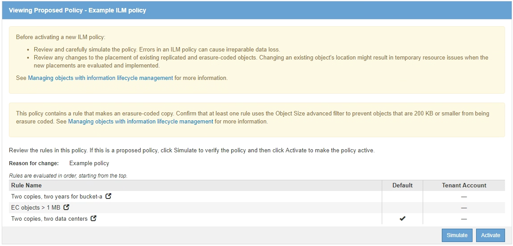

= 模擬ILM原則的範例
:allow-uri-read: 
:icons: font
:imagesdir: ../media/

[role="lead"]
這些範例說明如何在啟動ILM原則之前模擬ILM原則、以驗證ILM規則。

== 範例1：模擬提議的ILM原則時驗證規則

此範例說明如何在模擬建議的原則時驗證規則。

在此範例中、針對兩個儲存區中擷取的物件來模擬*範例ILM原則*。此原則包含三項規則、如下所示：

* 第一條規則*兩份複本（2年、2年用於Bucke-A*）僅適用於Bucke-a中的物件
* 第二個規則功能表：EC物件（1 MB）適用於所有儲存區、但會篩選大於1 MB的物件。
* 第三個規則是預設規則、不含任何篩選條件。

.步驟
. 新增規則並儲存原則之後、按一下*模擬*。
+
此時會出現「模擬ILM原則」對話方塊。

. 在「*物件*」欄位中、輸入測試物件的S3儲存區/物件金鑰或Swift容器/物件名稱、然後按一下「*模擬*」。
+
此時會出現模擬結果、顯示原則中的哪一項規則符合您測試的每個物件。

+
image::../media/simulate_policy_screen.png[模擬原則畫面]

. 確認每個物件都符合正確的規則。
+
在此範例中：

+
.. `bucket-a/bucket-a object.pdf` 正確符合第一個規則、該規則會篩選中的物件 `bucket-a`。
.. `bucket-b/test object greater than 1 MB.pdf` 在中 `bucket-b`因此不符合第一條規則。相反地、第二個規則會正確比對此規則、該規則會篩選大於1 MB的物件。
.. `bucket-b/test object less than 1 MB.pdf` 不符合前兩個規則中的篩選條件、因此會依預設規則放置、而不含篩選條件。

== 範例2：模擬提議的ILM原則時重新排序規則

此範例說明如何在模擬原則時重新排序規則、以變更結果。

在此範例中、*示範*原則正在模擬中。此原則旨在尋找具有series=x-men使用者中繼資料的物件、其中包含三項規則、如下所示：

* 第一條規則* PNG*會篩選以結束的金鑰名稱 `.png`。
* 第二個規則* X-men *僅適用於租戶A的物件和篩選器 `series=x-men` 使用者中繼資料：
* 最後一個規則*兩個複本兩個資料中心*是預設規則、它會比對任何不符合前兩個規則的物件。

image::../media/simulate_reorder_rules_pngs_rule.png[範例2：模擬提議的ILM原則時重新排序規則]

.步驟
. 新增規則並儲存原則之後、按一下*模擬*。
. 在「*物件*」欄位中、輸入測試物件的S3儲存區/物件金鑰或Swift容器/物件名稱、然後按一下「*模擬*」。
+
此時會出現模擬結果、顯示 `Havok.png` 物件已與* PNG*規則相符。

+
image::../media/simulate_reorder_rules_pngs_result.gif[範例2：模擬提議的ILM原則時重新排序規則]

+
不過、這是一項規則 `Havok.png` 對象是要測試的* X-men *規則。

. 若要解決此問題、請重新排序規則。
+
.. 按一下「*完成*」以關閉「模擬ILM原則」頁面。
.. 按一下*編輯*以編輯原則。
.. 將* X-men *規則拖曳到清單頂端。
+
image::../media/simulate_reorder_rules_correct_rule.png[模擬-重新排序規則-正確規則]

.. 按一下「 * 儲存 * 」。

. 按一下「*模擬*」。
+
您先前測試的物件會根據更新的原則重新評估、並顯示新的模擬結果。在範例中、「規則相符」欄會顯示 `Havok.png` 物件現在符合X-men中繼資料規則、如預期。上一個「比對」欄顯示、PNGs規則與先前模擬中的物件相符。

+
image::../media/simulate_reorder_rules_correct_result.gif[範例2：模擬提議的ILM原則時重新排序規則]

+

NOTE: 如果您停留在「設定原則」頁面、則可在進行變更後重新模擬原則、而不需要重新輸入測試物件的名稱。

== 範例3：模擬提議的ILM原則時修正規則

此範例說明如何模擬原則、修正原則中的規則、以及繼續模擬。

在此範例中、*示範*原則正在模擬中。此原則旨在尋找擁有的物件 `series=x-men` 使用者中繼資料：但是、針對模擬此原則時、卻發生非預期的結果 `Beast.jpg` 物件：物件不符合X-men中繼資料規則、而是符合預設規則、兩個複本複製兩個資料中心。

image::../media/simulate_results_for_object_wrong_metadata.png[範例3：模擬提議的ILM原則時修正規則]

當測試物件與原則中的預期規則不符時、您必須檢查原則中的每個規則、並修正任何錯誤。

.步驟
. 針對原則中的每個規則、按一下規則名稱或「更多詳細資料」圖示、即可檢視規則設定 image:../media/icon_nms_more_details.gif["更多詳細資料圖示"] 在顯示規則的任何對話方塊上。
. 檢閱規則的租戶帳戶、參考時間及篩選條件。
+
在此範例中、X-men規則的中繼資料包含錯誤。中繼資料值輸入為「'x-men1'」、而非「'x-men」。

+
image::../media/simulate_rules_select_rule_popup_with_wrong_metadata.png[範例3：模擬提議的ILM原則時修正規則]

. 若要解決錯誤、請依照下列步驟修正規則：
+
** 如果規則是建議原則的一部分、您可以複製規則、或是從原則中移除規則、然後加以編輯。
** 如果規則是作用中原則的一部分、則必須複製規則。您無法編輯或移除作用中原則的規則。
+
[cols="1a,3a"]
|===
| 選項 | 說明 

 a| 
複製規則
 a| 
... 選擇* ILM *>* Rules *。
... 選取不正確的規則、然後按一下* Clone（複製）*。
... 變更不正確的資訊、然後按一下「*儲存*」。
... 選擇* ILM *>* Policies *。
... 選取建議的原則、然後按一下*編輯*。
... 按一下*選取規則*。
... 選取新規則的核取方塊、取消核取原始規則的核取方塊、然後按一下「*套用*」。
... 按一下「 * 儲存 * 」。

 a| 
編輯規則
 a| 
... 選取建議的原則、然後按一下*編輯*。
... 按一下刪除圖示 image:../media/icon_nms_delete_new.gif["刪除圖示"] 若要移除不正確的規則、請按一下「*儲存*」。
... 選擇* ILM *>* Rules *。
... 選取不正確的規則、然後按一下*編輯*。
... 變更不正確的資訊、然後按一下「*儲存*」。
... 選擇* ILM *>* Policies *。
... 選取建議的原則、然後按一下*編輯*。
... 選取修正後的規則、按一下*「Apply」（套用）*、然後按一下「* Save」（*儲存）*。

|===

. 再次執行模擬。
+

NOTE: 由於您已離開ILM原則頁面來編輯規則、因此先前輸入的模擬物件將不再顯示。您必須重新輸入物件名稱。

+
在此範例中、修正後的X-men規則現在會符合 `Beast.jpg` 物件基礎 `series=x-men` 使用者中繼資料、如預期。

+
image::../media/simulate_results_for_object_corrected_metadata.gif[範例3：模擬提議的ILM原則時修正規則]

