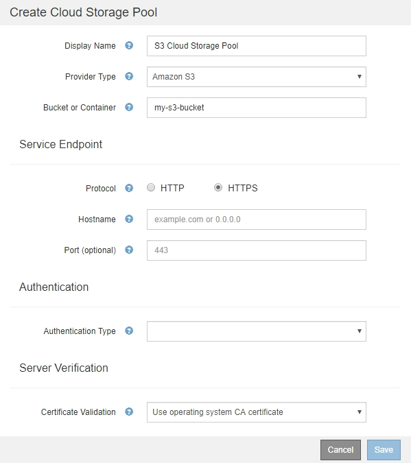

= S3：指定雲端儲存資源池的驗證詳細資料
:allow-uri-read: 
:icons: font
:imagesdir: ../media/

[role="lead"]
當您為S3建立雲端儲存資源池時、必須選取雲端儲存資源池端點所需的驗證類型。您可以指定「匿名」或輸入存取金鑰ID和秘密存取金鑰。

.您需要的產品
* 您必須輸入Cloud Storage Pool的基本資訊、並將* Amazon S3 *指定為供應商類型。
+

* 如果您使用存取金鑰驗證、則必須知道外部S3儲存區的存取金鑰ID和秘密存取金鑰。

.步驟
. 在*服務端點*區段中、提供下列資訊：
+
.. 選取連線至雲端儲存資源池時要使用的傳輸協定。
+
預設傳輸協定為HTTPS。

.. 輸入Cloud Storage Pool的伺服器主機名稱或IP位址。
+
例如：

+
`s3-_aws-region_.amazonaws.com`

+

NOTE: 請勿在此欄位中包含庫位名稱。您可以在* Bucket或Container-*欄位中加入Bucket名稱。

.. 或者、指定連線至雲端儲存資源池時應使用的連接埠。
+
將此欄位留白以使用預設連接埠：連接埠443用於HTTPS、連接埠80用於HTTP。

. 在「*驗證*」區段中、選取Cloud Storage Pool端點所需的驗證類型。
+
[cols="1a,2a"]
|===
| 選項 | 說明 

 a| 
存取金鑰
 a| 
存取Cloud Storage Pool儲存庫時、必須提供存取金鑰ID和秘密存取金鑰。

 a| 
匿名
 a| 
每個人都能存取Cloud Storage Pool資源桶。不需要存取金鑰ID和秘密存取金鑰。

 a| 
CAP（C2S存取入口網站）
 a| 
僅適用於CZS S3。前往 link:c2s-s3-authentication-details-for-cloud-storage-pool.html["C2S S3：指定雲端儲存資源池的驗證詳細資料"]。

|===
. 如果您選取存取金鑰、請輸入下列資訊：
+
[cols="1a,2a"]
|===
| 選項 | 說明 

 a| 
存取金鑰ID
 a| 
擁有外部庫位之帳戶的存取金鑰ID。

 a| 
機密存取金鑰
 a| 
相關的秘密存取金鑰。

|===
. 在「伺服器驗證」區段中、選取驗證TLS連線至雲端儲存池之憑證的方法：
+
[cols="1a,2a"]
|===
| 選項 | 說明 

 a| 
使用作業系統CA憑證
 a| 
使用作業系統上安裝的預設CA憑證來保護連線安全。

 a| 
使用自訂CA憑證
 a| 
使用自訂CA憑證。按一下「*選取「新增*」、然後上傳PEM/encoded CA憑證。

 a| 
請勿驗證憑證
 a| 
用於TLS連線的憑證尚未驗證。

|===
. 按一下「 * 儲存 * 」。

當您儲存雲端儲存資源池時StorageGRID 、下列功能將會隨之執行：

* 驗證儲存區和服務端點是否存在、以及是否可以使用您指定的認證來達到。
* 將標記檔案寫入儲存區、以將儲存區識別為雲端儲存資源池。請勿移除此檔案、其名稱為 `x-ntap-sgws-cloud-pool-uuid`。

如果Cloud Storage Pool驗證失敗、您會收到錯誤訊息、說明驗證失敗的原因。例如、如果發生憑證錯誤或您指定的儲存區不存在、可能會報告錯誤。

image::../media/cloud_storage_pool_create_error.gif[雲端儲存資源池建立錯誤]

請參閱疑難排解Cloud Storage Pool的指示、解決問題、然後再次嘗試儲存Cloud Storage Pool。

.相關資訊
link:troubleshooting-cloud-storage-pools.html["疑難排解雲端儲存資源池"]
