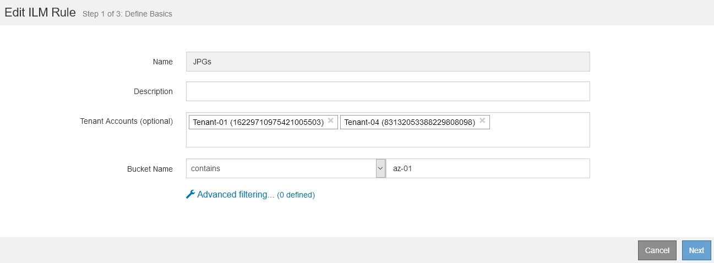

= 使用ILM規則和ILM原則
:allow-uri-read: 
:icons: font
:imagesdir: ../media/

[role="lead"]
建立ILM規則和ILM原則之後、您就可以繼續使用這些規則、並在儲存需求變更時修改其組態。

== 刪除ILM規則

若要讓目前ILM規則的清單保持可管理的狀態、請刪除您不可能使用的任何ILM規則。

.您需要的產品
* 您必須使用支援的瀏覽器登入Grid Manager。
* 您必須擁有特定的存取權限。

[NOTE]
====
如果目前在作用中原則或建議的原則中使用ILM規則、則無法刪除該規則。如果您需要刪除使用原則的ILM規則、必須先執行下列步驟：

. 複製作用中原則或編輯建議的原則。
. 從原則中移除ILM規則。
. 儲存、模擬及啟動新原則、以確保物件受到預期的保護。

====
.步驟
. 選擇* ILM *>* Rules *。
. 檢閱您要移除之規則的表格項目。
+
確認該規則未用於作用中的ILM原則或建議的ILM原則。

. 如果您要移除的規則未在使用中、請選取選項按鈕、然後選取*移除*。
. 選擇*確定*以確認您要刪除ILM規則。
+
ILM規則隨即刪除。

+
[NOTE]
====
如果您刪除了歷史原則中使用的規則 image:../media/icon_ilm_rule_historical.png["圖示ILM規則歷史"] 當您檢視原則時、規則的圖示會出現、表示該規則已成為歷史規則。

image::../media/ilm_rule_historical.png[ILM規則歷史]

====

.相關資訊
link:creating-ilm-policy.html["建立ILM原則"]

== 編輯ILM規則

您可能需要編輯ILM規則、才能變更篩選或放置指示。

.您需要的產品
* 您必須使用支援的瀏覽器登入Grid Manager。
* 您必須擁有特定的存取權限。

.關於這項工作
如果規則用於建議的ILM原則或作用中的ILM原則、則無法編輯該規則。您可以複製這些規則、並對複製的複本進行任何必要的變更。您也無法編輯StorageGRID 在版本號為10.3之前建立的常用ILM規則（複製2份）或ILM規則。

NOTE: 在將已編輯的規則新增至作用中ILM原則之前、請注意、變更物件的放置指示可能會增加系統負載。

.步驟
. 選擇* ILM *>* Rules *。
+
此時將顯示ILM Rules（ILM規則）頁面。此頁面會顯示所有可用的規則、並指出作用中原則或建議原則中使用的規則。

+
image::../media/ilm_rules_page_with_edit_and_clone_enabled.png[ILM規則頁面]

. 選取未使用的規則、然後按一下*編輯*。
+
隨即開啟「編輯ILM規則」精靈。

+

. 完成「編輯ILM規則」精靈的頁面、並依照建立ILM規則的步驟、視需要使用進階篩選器。
+
編輯ILM規則時、您無法變更其名稱。

. 按一下「 * 儲存 * 」。
+
[NOTE]
====
如果您編輯用於歷史原則的規則 image:../media/icon_ilm_rule_historical.png["圖示ILM規則歷史"] 當您檢視原則時、規則的圖示會出現、表示該規則已成為歷史規則。

image::../media/ilm_rule_historical.png[ILM規則歷史]

====

.相關資訊
link:creating-ilm-rule.html["建立ILM規則"]

link:using-advanced-filters-in-ilm-rules.html["在ILM規則中使用進階篩選器"]

== 複製ILM規則

如果規則用於建議的ILM原則或作用中的ILM原則、則無法編輯該規則。您可以複製規則、並對複製的複本進行必要的變更。然後、如果需要、您可以從建議的原則中移除原始規則、並以修改後的版本加以取代。如果ILM規則是使用StorageGRID 版本10.2或更早版本建立、則無法複製該規則。

.您需要的產品
* 您必須使用支援的瀏覽器登入Grid Manager。
* 您必須擁有特定的存取權限。

.關於這項工作
在將複製規則新增至作用中ILM原則之前、請注意、變更物件的放置指示可能會增加系統負載。

.步驟
. 選擇* ILM *>* Rules *。
+
此時將顯示ILM Rules（ILM規則）頁面。

+
image::../media/ilm_rules_page_with_edit_and_clone_enabled.png[ILM規則頁面]

. 選取您要複製的ILM規則、然後按一下* Clone（複製）*。
+
隨即開啟「建立ILM規則」精靈。

. 請依照下列步驟編輯ILM規則並使用進階篩選器來更新複製的規則。
+
複製ILM規則時、您必須輸入新名稱。

. 按一下「 * 儲存 * 」。
+
隨即建立新的ILM規則。

.相關資訊
link:working-with-ilm-rules-and-ilm-policies.html["使用ILM規則和ILM原則"]

link:using-advanced-filters-in-ilm-rules.html["在ILM規則中使用進階篩選器"]

== 檢視ILM原則活動佇列

您可以隨時檢視佇列中要根據ILM原則評估的物件數目。您可能想要監控ILM處理佇列、以判斷系統效能。大量佇列可能表示系統無法跟上擷取速度、用戶端應用程式的負載太大、或是存在異常狀況。

.您需要的產品
* 您必須使用支援的瀏覽器登入Grid Manager。
* 您必須擁有特定的存取權限。

.步驟
. 選擇*儀表板*。
+
image::../media/grid_manager_dashboard.png[Grid Management介面中的儀表板]

. 監控資訊生命週期管理（ILM）區段。
+
您可以按一下問號 image:../media/icon_nms_question.gif["問號圖示"] 以查看本節中項目的說明。

