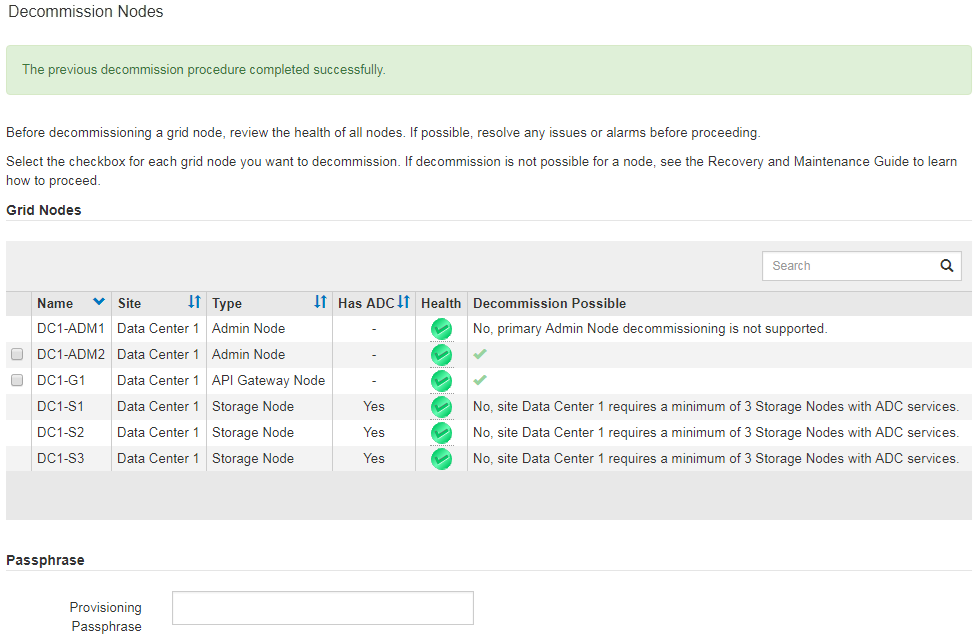

= 解除委任已連線的網格節點
:allow-uri-read: 
:icons: font
:imagesdir: ../media/

[role="lead"]
您可以取消委任並永久移除連接至網格的節點。

.您需要的產品
* 您瞭解汰換網格節點的需求與考量。
+
link:considerations-for-decommissioning-grid-nodes.html["汰換網格節點時的考量事項"]

* 您已收集所有必要資料。
* 您已確保沒有任何資料修復工作處於作用中狀態。
* 您已確認儲存節點還原在網格中的任何位置均未進行。如果是、您必須等到恢復完成時執行任何Cassandra重新建置。然後您可以繼續解除委任。
* 您已確保在節點取消委任程序執行期間不會執行其他維護程序、除非節點取消委任程序暫停。
* 您有資源配置通關密碼。
* 網格節點已連線。
* 您要取消委任的節點*可能取消委任*欄位會加上綠色核取符號。
* 所有網格節點的健全狀況均為正常（綠色） image:../media/icon_alarn_green_checkmark.gif["綠色勾號圖示"]。如果您在「* Health *」（*健全狀況*）欄中看到下列其中一個圖示、您必須嘗試解決此問題：
+
|===

| 圖示 | 色彩 | 嚴重性 

 a| 
image:../media/icon_alarm_yellow_notice.gif["黃色方塊圖示"]
 a| 
黃色
 a| 
注意

 a| 
image:../media/icon_alarm_light_orange_minor.gif["淺橘鑽石圖示"]
 a| 
淡橘色
 a| 
次要

 a| 
image:../media/icon_alarm_orange_major.gif["暗橘鑽石圖示"]
 a| 
暗橘色
 a| 
主要

 a| 
image:../media/icon_alarm_red_critical.gif["紅色x圖示"]
 a| 
紅色
 a| 
關鍵

|===
* 如果您先前已停用中斷連線的儲存節點、則資料修復工作都已成功完成。請參閱檢查資料修復工作的指示。

IMPORTANT: 在本程序指示之前、請勿移除網格節點的虛擬機器或其他資源。

.步驟
. 從「取消委任節點」頁面中、選取您要取消委任之每個網格節點的核取方塊。
. 輸入資源配置通關密碼。
+
「*開始取消委任*」按鈕已啟用。

. 按一下*開始取消委任*。
+
隨即顯示確認對話方塊。

+
image::../media/decommission_confirmation.gif[取消委任確認對話方塊的快照]

. 檢閱所選節點的清單、然後按一下*確定*。
+
節點取消委任程序隨即開始、並顯示每個節點的進度。在程序期間、系統會產生新的恢復套件、以顯示網格組態變更。

+
image::../media/decommission_nodes_procedure_in_progress.png[正在取消委任節點的快照]

+

IMPORTANT: 取消委任程序開始後、請勿讓儲存節點離線。變更狀態可能會導致部分內容無法複製到其他位置。

. 一旦新的恢復套件可用、請按一下連結或選取*維護*系統*恢復套件*、以存取「恢復套件」頁面。然後下載 `.zip` 檔案：
+
請參閱下載恢復套件的指示。

+

NOTE: 請盡快下載恢復套件、以確保在取消委任程序期間發生問題時、您可以恢復網格。

. 定期監控「取消委任節點」頁面、確保所有選取的節點都能順利停用。
+
儲存節點可能需要數天或數週的時間才能取消委任。當所有工作都完成時、會重新顯示節點選擇清單、並顯示成功訊息。

+

. 請依照您的平台所需的適當步驟進行。例如：
+
** * Linux *：您可能想要分離磁碟區、並刪除安裝期間建立的節點組態檔。
** * VMware*：您可能想要使用vCenter「從磁碟刪除」選項來刪除虛擬機器。您可能還需要刪除任何獨立於虛擬機器的資料磁碟。
** * StorageGRID 《*》應用裝置*：應用裝置節點會自動恢復為未部署狀態、您可在此存取StorageGRID 《應用程式安裝程式》。您可以關閉產品電源、或將其新增至StorageGRID 其他的系統。

完成節點取消委任程序後、請完成下列步驟：

* 請確保已淘汰的網格節點磁碟機已清除。使用市售的資料抹除工具或服務、永久且安全地移除磁碟機中的資料。
* 如果您停用了某個應用裝置節點、但設備上的資料是使用節點加密來保護、請使用StorageGRID 此應用裝置安裝程式來清除金鑰管理伺服器組態（清除KMS）。如果您想要在其他網格中使用應用裝置、則必須清除KMS組態。
+
link:../sg100-1000/index.html["SG100  機；SG1000服務應用裝置"]

+
link:../sg5600/index.html["SG5600儲存設備"]

+
link:../sg5700/index.html["SG5700儲存設備"]

+
link:../sg6000/index.html["SG6000儲存設備"]

.相關資訊
link:checking-data-repair-jobs.html["正在檢查資料修復工作"]

link:downloading-recovery-package.html["正在下載恢復套件"]

link:../rhel/index.html["安裝Red Hat Enterprise Linux或CentOS"]
