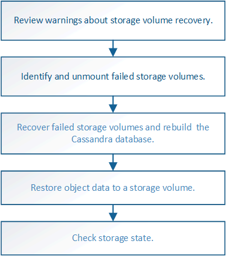

= 從系統磁碟機不受影響的儲存磁碟區故障中恢復
:allow-uri-read: 
:icons: font
:imagesdir: ../media/

[role="lead"]
您必須完成一系列的工作、才能還原軟體型儲存節點、其中儲存節點上的一個或多個儲存磁碟區發生故障、但系統磁碟機仍未受損。如果只有儲存磁碟區故障、StorageGRID 則儲存節點仍可用於作業系統。

.關於這項工作
此恢復程序僅適用於軟體型儲存節點。如果應用裝置儲存節點上的儲存磁碟區故障、請使用「恢復StorageGRID 應用程式儲存節點」程序。

.相關資訊
link:recovering-storagegrid-appliance-storage-node.html["恢復StorageGRID 功能不整的應用程式儲存節點"]

.步驟
* link:reviewing-warnings-about-storage-volume-recovery.html["檢閱有關儲存磁碟區恢復的警告"]
* link:identifying-and-unmounting-failed-storage-volumes.html["識別及卸載故障的儲存磁碟區"]
* link:recovering-failed-storage-volumes-and-rebuilding-cassandra-database.html["恢復故障的儲存磁碟區並重建Cassandra資料庫"]
* link:restoring-object-data-to-storage-volume-where-system-drive-is-intact.html["將物件資料還原至系統磁碟機不受影響的儲存磁碟區"]
* link:checking-storage-state-after-recovering-storage-volumes.html["恢復儲存磁碟區後檢查儲存狀態"]

