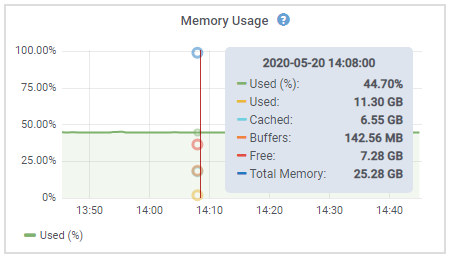

= 顯示圖表
:allow-uri-read: 
:icons: font
:imagesdir: ../media/

[role="lead"]
節點頁面包含您應定期存取的圖表、以監控儲存容量和處理量等屬性。在某些情況下、尤其是與技術支援合作時、您可以使用*支援*>*工具*>*網格拓撲*頁面來存取其他圖表。

.您需要的產品
您必須使用支援的瀏覽器登入Grid Manager。

.步驟
. 選擇*節點*。然後選取節點、站台或整個網格。
. 選取您要檢視其資訊的索引標籤。
+
有些索引標籤包含一或多個Grafana圖表、可用來繪製Prometheus測量數據的值。例如、節點的*節點*>*硬體*索引標籤包含兩個Grafana圖表。

+
image::../media/nodes_page_hardware_tab_graphs.png[節點頁面硬體索引標籤圖表]

. 您也可以將游標暫留在圖表上、查看特定時間點的詳細值。
+

. 視需要、您通常可以顯示特定屬性或度量的圖表。在「節點」頁面的表格中、按一下圖表圖示 image:../media/icon_chart_new.gif["圖表圖示"] 或 image:../media/icon_chart_new_for_11_5.png["圖表圖示-適用於11.5的新功能"] 屬性名稱的右側。
+

NOTE: 並非所有的指標和屬性都有可用的圖表。

+
*範例1*：在儲存節點的「物件」索引標籤中、您可以按一下圖表圖示 image:../media/icon_chart_new.gif["圖表圖示"] 查看中繼資料查詢一段時間的平均延遲時間。

+
image::../media/icon_nodes_average_latency_chart.png[節點平均延遲圖示]

+
image::../media/charts_average_query_latency.png[圖表平均查詢延遲]

+
*範例2*：在儲存節點的「物件」索引標籤中、您可以按一下圖表圖示 image:../media/icon_chart_new_for_11_5.png["圖表圖示-適用於11.5的新功能"] 查看一段時間內偵測到的遺失物件數之Grafana圖表。

+
image::../media/object_count_table.png[物件計數表]

+
image::../media/charts_lost_object_detected.png[偵測到圖表遺失物件]

. 若要顯示節點頁面上未顯示之屬性的圖表、請選取*支援*>*工具*>*網格拓撲*。
. 選擇*網格節點_*>*元件或服務_*>*總覽*>*主要*。
+
image::../media/nms_chart.gif[周邊文字所述的螢幕擷取畫面]

. 按一下圖表圖示 image:../media/icon_chart_new.gif["圖表圖示"] 屬性旁的。
+
顯示畫面會自動變更為「*報告*>*圖表*」頁面。圖表會顯示屬性過去一天的資料。

