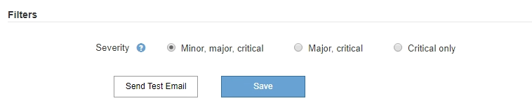

= 管理警示
:allow-uri-read: 
:icons: font
:imagesdir: ../media/

[role="lead"]
警示功能可讓您監控StorageGRID 您的系統內部的各種事件和狀況。您可以建立自訂警示、編輯或停用預設警示、設定警示的電子郵件通知、以及將警示通知靜音、藉此管理警示。

.相關資訊
link:viewing-current-alerts.html["檢視目前警示"]

link:viewing-resolved-alerts.html["檢視已解決的警示"]

link:viewing-specific-alert.html["檢視特定警示"]

link:alerts-reference.html["警示參考資料"]

== 什麼是警示

警示系統提供易於使用的介面、可偵測、評估及解決StorageGRID 在執行過程中可能發生的問題。

* 警示系統著重於系統中可採取行動的問題。與舊系統中的某些警示不同、警示會針對需要您立即注意的事件觸發、而非針對可安全忽略的事件觸發。
* 「目前警示」頁面提供使用者友好的介面、可用來檢視目前的問題。您可以依個別警示和警示群組來排序清單。例如、您可能想要依節點/站台排序所有警示、以查看哪些警示會影響特定節點。或者、您可能想要依觸發時間排序群組中的警示、以尋找特定警示的最新執行個體。
* 「已解決警示」頁面提供的資訊與「目前警示」頁面類似、但它可讓您搜尋並檢視已解決警示的歷史記錄、包括警示觸發時間和解決時間。
* 相同類型的多個警示會分成一封電子郵件、以減少通知數量。此外、同類型的多個警示會在「警示」頁面上顯示為群組。您可以展開及收合警示群組、以顯示或隱藏個別警示。例如、如果數個節點同時回報*無法與節點*通訊警示、則只會傳送一封電子郵件、而且警示會在警示頁面上顯示為群組。
* 警示使用直覺式名稱和說明、協助您快速瞭解問題所在。警示通知包括受影響節點和站台的詳細資料、警示嚴重性、觸發警示規則的時間、以及警示相關度量的目前值。
* 警示電子郵件通知和「目前警示」和「已解決警示」頁面上的警示清單、提供解決警示的建議行動。這些建議的行動通常包括StorageGRID 直接連結至「佐證」文件中心、以便更容易找到及存取更詳細的疑難排解程序。
* 如果您需要暫時隱藏一或多個嚴重性層級的警示通知、您可以輕鬆地將特定警示規則靜音一段指定時間、以及整個網格、單一站台或單一節點。您也可以將所有警示規則設為靜音、例如在軟體升級等計畫性維護程序期間。
* 您可以視需要編輯預設警示規則。您可以完全停用警示規則、或變更其觸發條件和持續時間。
* 您可以建立自訂警示規則、以鎖定與您的情況相關的特定條件、並提供您自己建議的行動。若要定義自訂警示的條件、您可以使用Grid Management API的Metrics區段提供的Prometheus度量來建立運算式。

== 管理警示規則

警示規則定義觸發特定警示的條件。包含一組預設警示規則、您可以使用或修改這些規則、也可以建立自訂警示規則。StorageGRID

=== 檢視警示規則

您可以檢視所有預設和自訂警示規則的清單、以瞭解哪些條件會觸發每個警示、並查看是否已停用任何警示。

.您需要的產品
* 您必須使用支援的瀏覽器登入Grid Manager。
* 您必須擁有「管理警示」或「根存取」權限。

.步驟
. 選擇*警示*>*警示規則*。
+
此時會出現警示規則頁面。

+
image::../media/alert_rules_page.png[警示規則頁面]

. 檢閱警示規則表中的資訊：
+
|===
| 欄標題 | 說明 

 a| 
名稱
 a| 
警示規則的唯一名稱和說明。自訂警示規則會先列出、然後依循預設警示規則。警示規則名稱是電子郵件通知的主旨。

 a| 
條件
 a| 
判斷何時觸發此警示的Prometheus運算式。警示可在下列一個或多個嚴重性層級觸發、但不需要每個嚴重性層級的條件。

** *重大* image:../media/icon_alert_red_critical.png["圖示警示紅色嚴重"]：存在異常情況、導致StorageGRID 停止執行某個節點或服務的正常作業。您必須立即解決基礎問題。如果問題仍未解決、可能會導致服務中斷和資料遺失。
** *重大* image:../media/icon_alert_orange_major.png["圖示警示橘色主要"]：存在影響當前操作或接近臨界警示臨界值的異常情況。您應調查重大警示並解決任何潛在問題、確保異常狀況不會停止StorageGRID 執行任何節點或服務的正常運作。
** *次要* image:../media/icon_alert_yellow_miinor.png["圖示警示黃色次要"]：系統正常運作、但存在異常狀況、如果系統持續運作、可能會影響系統的運作能力。您應該自行監控並解決不清楚的次要警示、以確保它們不會造成更嚴重的問題。

 a| 
類型
 a| 
警示規則類型：

** *預設*：系統隨附的警示規則。您可以停用預設警示規則、或編輯預設警示規則的條件和持續時間。您無法移除預設警示規則。
** *預設*：包含編輯條件或持續時間的預設警示規則。視需要、您可以輕鬆地將修改後的條件還原為原始預設值。
** *自訂*：您建立的警示規則。您可以停用、編輯及移除自訂警示規則。

 a| 
狀態
 a| 
此警示規則目前是否已啟用或停用。停用警示規則的條件不會評估、因此不會觸發警示。

|===

.相關資訊
link:alerts-reference.html["警示參考資料"]

=== 建立自訂警示規則

您可以建立自訂警示規則、以定義自己觸發警示的條件。

.您需要的產品
* 您必須使用支援的瀏覽器登入Grid Manager。
* 您必須擁有「管理警示」或「根存取」權限。

.關於這項工作
無法驗證自訂警示。StorageGRID如果您決定建立自訂警示規則、請遵循下列一般準則：

* 查看預設警示規則的條件、並將其做為自訂警示規則的範例。
* 如果您為警示規則定義多個條件、請針對所有條件使用相同的運算式。然後變更每個條件的臨界值。
* 仔細檢查每個條件是否有錯字和邏輯錯誤。
* 僅使用Grid Management API中列出的度量。
* 使用Grid Management API測試運算式時、請注意、「成功」回應可能只是空的回應實體（未觸發警示）。若要查看警示是否實際觸發、您可以暫時將臨界值設定為目前預期為真的值。
+
例如、測試運算式 `node_memory_MemTotal_bytes < 24000000000`、請先執行 `node_memory_MemTotal_bytes >= 0` 並確保取得預期結果（所有節點都會傳回值）。接著、將運算子和臨界值變更回預期值、然後再次執行。沒有任何結果表示此運算式目前沒有警示。

* 除非您已驗證警示已在預期時觸發、否則請勿假設自訂警示正常運作。

.步驟
. 選擇*警示*>*警示規則*。
+
此時會出現警示規則頁面。

. 選取*建立自訂規則*。
+
「建立自訂規則」對話方塊隨即出現。

+
image::../media/alerts_create_custom_rule.png[警示>建立自訂規則]

. 選取或取消選取「*已啟用*」核取方塊、以判斷此警示規則目前是否已啟用。
+
如果停用警示規則、則不會評估其運算式、也不會觸發警示。

. 輸入下列資訊：
+
|===
| 欄位 | 說明 

 a| 
唯一名稱
 a| 
此規則的唯一名稱。警示規則名稱會顯示在「警示」頁面上、也是電子郵件通知的主旨。警示規則的名稱可以介於1到64個字元之間。

 a| 
說明
 a| 
所發生問題的說明。說明是警示訊息、顯示在「警示」頁面和電子郵件通知中。警示規則的說明可介於1到128個字元之間。

 a| 
建議行動
 a| 
也可以選擇觸發此警示時要採取的建議行動。以純文字輸入建議的動作（無格式化代碼）。警示規則的建議動作可介於0到1,024個字元之間。

|===
. 在「條件」區段中、輸入一或多個警示嚴重性層級的Prometheus運算式。
+
基本運算式通常採用以下形式：

+
[listing]
----
[metric] [operator] [value]
----
+
運算式可以是任何長度、但會出現在使用者介面的單行上。至少需要一個運算式。

+
若要查看可用的度量並測試Prometheus運算式、請按一下說明圖示 image:../media/icon_nms_question.gif["問號圖示"] 並依照網格管理API的「度量」區段連結進行。

+
若要深入瞭解如何使用Grid Management API、請參閱《管理StorageGRID 》介紹。如需Prometheus查詢語法的詳細資訊、請參閱Prometheus的文件。

+
如果節點安裝的RAM容量少於24、000、000、000位元組（24 GB）、則會觸發警示。

+
[listing]
----
node_memory_MemTotal_bytes < 24000000000
----
. 在*持續時間*欄位中、輸入觸發警示之前條件必須持續有效的時間量、然後選取時間單位。
+
要在條件變爲true時立即觸發警報，請輸入*0*。請增加此值、以防止暫時性情況觸發警示。

+
預設值為5分鐘。

. 按一下「 * 儲存 * 」。
+
對話方塊隨即關閉、新的自訂警示規則會出現在警示規則表格中。

.相關資訊
link:../admin/index.html["管理StorageGRID"]

link:commonly-used-prometheus-metrics.html["常用的Prometheus指標"]

https://["Prometheus：查詢基礎"]

=== 編輯警示規則

您可以編輯警示規則來變更觸發條件、針對自訂警示規則、也可以更新規則名稱、說明及建議的動作。

.您需要的產品
* 您必須使用支援的瀏覽器登入Grid Manager。
* 您必須擁有「管理警示」或「根存取」權限。

.關於這項工作
當您編輯預設警示規則時、可以變更次要、主要和關鍵警示的條件、以及持續時間。當您編輯自訂警示規則時、也可以編輯規則的名稱、說明和建議的動作。

IMPORTANT: 決定編輯警示規則時請務必小心。如果您變更觸發值、則在無法完成關鍵作業之前、可能無法偵測潛在問題。

.步驟
. 選擇*警示*>*警示規則*。
+
此時會出現警示規則頁面。

. 選取您要編輯之警示規則的選項按鈕。
. 選擇*編輯規則*。
+
「編輯規則」對話方塊隨即出現。此範例顯示預設警示規則：「Unique Name（唯一名稱）」、「Description（說明）」及「Recommended Actions（建議動作）」欄位已停用、無法編輯。

+
image::../media/alert_rules_edit_rule.png[警示>編輯規則]

. 選取或取消選取「*已啟用*」核取方塊、以判斷此警示規則目前是否已啟用。
+
如果停用警示規則、則不會評估其運算式、也不會觸發警示。

+

NOTE: 如果停用目前警示的警示規則、您必須等待數分鐘、使警示不再顯示為作用中警示。

+

IMPORTANT: 一般而言、不建議停用預設警示規則。如果警示規則已停用、則在無法完成關鍵作業之前、您可能不會偵測到潛在問題。

. 如需自訂警示規則、請視需要更新下列資訊。
+

NOTE: 您無法針對預設警示規則編輯此資訊。

+
|===
| 欄位 | 說明 

 a| 
唯一名稱
 a| 
此規則的唯一名稱。警示規則名稱會顯示在「警示」頁面上、也是電子郵件通知的主旨。警示規則的名稱可以介於1到64個字元之間。

 a| 
說明
 a| 
所發生問題的說明。說明是警示訊息、顯示在「警示」頁面和電子郵件通知中。警示規則的說明可介於1到128個字元之間。

 a| 
建議行動
 a| 
也可以選擇觸發此警示時要採取的建議行動。以純文字輸入建議的動作（無格式化代碼）。警示規則的建議動作可介於0到1,024個字元之間。

|===
. 在「條件」區段中、輸入或更新一或多個警示嚴重性層級的Prometheus運算式。
+

NOTE: 如果您想要將已編輯的預設警示規則的條件還原回原始值、請按一下修改條件右側的三個點。

+
image::../media/alert_rules_edit_revert_to_default.png[警示規則：將已編輯的條件還原為預設值]

+

NOTE: 如果您更新目前警示的條件、則在解決先前的條件之前、您的變更可能不會實作。下次符合規則的其中一個條件時、警示將會反映更新的值。

+
基本運算式通常採用以下形式：

+
[listing]
----
[metric] [operator] [value]
----
+
運算式可以是任何長度、但會出現在使用者介面的單行上。至少需要一個運算式。

+
若要查看可用的度量並測試Prometheus運算式、請按一下說明圖示 image:../media/icon_nms_question.gif["問號圖示"] 並依照網格管理API的「度量」區段連結進行。

+
若要深入瞭解如何使用Grid Management API、請參閱《管理StorageGRID 》介紹。如需Prometheus查詢語法的詳細資訊、請參閱Prometheus的文件。

+
如果節點安裝的RAM容量少於24、000、000、000位元組（24 GB）、則會觸發警示。

+
[listing]
----
node_memory_MemTotal_bytes < 24000000000
----
. 在*持續時間*欄位中、輸入觸發警示之前條件必須持續保持有效的時間量、然後選取時間單位。
+
要在條件變爲true時立即觸發警報，請輸入*0*。請增加此值、以防止暫時性情況觸發警示。

+
預設值為5分鐘。

. 按一下「 * 儲存 * 」。
+
如果您編輯了預設警示規則、*預設*會出現在類型欄中。如果您停用預設或自訂警示規則、*停用*會出現在*狀態*欄中。

.相關資訊
link:../admin/index.html["管理StorageGRID"]

link:commonly-used-prometheus-metrics.html["常用的Prometheus指標"]

https://["Prometheus：查詢基礎"]

=== 停用警示規則

您可以變更預設或自訂警示規則的啟用/停用狀態。

.您需要的產品
* 您必須使用支援的瀏覽器登入Grid Manager。
* 您必須擁有「管理警示」或「根存取」權限。

.關於這項工作
停用警示規則時、系統不會評估其運算式、也不會觸發警示。

IMPORTANT: 一般而言、不建議停用預設警示規則。如果警示規則已停用、則在無法完成關鍵作業之前、您可能不會偵測到潛在問題。

.步驟
. 選擇*警示*>*警示規則*。
+
此時會出現警示規則頁面。

. 選取您要停用或啟用之警示規則的選項按鈕。
. 選擇*編輯規則*。
+
「編輯規則」對話方塊隨即出現。

. 選取或取消選取「*已啟用*」核取方塊、以判斷此警示規則目前是否已啟用。
+
如果停用警示規則、則不會評估其運算式、也不會觸發警示。

+

NOTE: 如果停用目前警示的警示規則、您必須等待數分鐘、讓警示不再顯示為作用中警示。

. 按一下「 * 儲存 * 」。
+
*停用*會出現在*狀態*欄中。

=== 移除自訂警示規則

如果您不想再使用自訂警示規則、可以將其移除。

.您需要的產品
* 您必須使用支援的瀏覽器登入Grid Manager。
* 您必須擁有「管理警示」或「根存取」權限。

.步驟
. 選擇*警示*>*警示規則*。
+
此時會出現警示規則頁面。

. 選取您要移除之自訂警示規則的選項按鈕。
+
您無法移除預設警示規則。

. 按一下「*移除自訂規則*」。
+
隨即顯示確認對話方塊。

. 按一下「*確定*」以移除警示規則。
+
警示的任何作用中執行個體都會在10分鐘內解決。

== 管理警示通知

觸發警示時StorageGRID 、功能區可傳送電子郵件通知和簡單網路管理傳輸協定（SNMP）通知（陷阱）。

=== 設定SNMP警示通知

如果您想StorageGRID 要在警示發生時傳送SNMP通知、您必須啟用StorageGRID 此功能、並設定一個或多個設陷目的地。

.關於這項工作
您可以使用Grid Manager中的*組態*>*監控*>* SNMP代理程式*選項、或是Grid Management API的SNMP端點、來啟用及設定StorageGRID SURE SNMP代理程式。SNMP代理程式支援所有三種版本的SNMP傳輸協定。

若要瞭解如何設定SNMP代理程式、請參閱使用SNMP監控一節。

設定StorageGRID 完SURE SNMP代理程式後、即可傳送兩種事件導向通知：

* 陷阱是SNMP代理程式傳送的通知、不需要管理系統確認。陷阱可讓管理系統知道StorageGRID 在某些情況下發生、例如觸發警示。SNMP的所有三個版本均支援陷阱
* 通知類似於陷阱、但需要管理系統確認。如果SNMP代理程式在一定時間內未收到確認訊息、則會重新傳送通知、直到收到確認訊息或達到最大重試值為止。在SNMPv2c和v3中支援通知。

在任何嚴重性層級觸發預設或自訂警示時、都會傳送陷阱和通知。若要隱藏警示的SNMP通知、您必須設定警示的靜音。警示通知是由任何設定為偏好傳送者的管理節點所傳送。預設會選取主要管理節點。如需詳細資訊、請參閱《關於管理StorageGRID 功能的說明》。

NOTE: 當特定警示（舊系統）在指定的嚴重性等級或更高等級觸發時、也會傳送陷阱和通知；不過、並非針對每個警示或每個警示嚴重性傳送SNMP通知。

.相關資訊
link:using-snmp-monitoring.html["使用SNMP監控"]

link:managing-alerts.html["將警示通知靜音"]

link:../admin/index.html["管理StorageGRID"]

link:alarms-that-generate-snmp-notifications.html["產生SNMP通知的警示（舊系統）"]

=== 設定警示的電子郵件通知

如果您想要在警示發生時傳送電子郵件通知、您必須提供有關您的SMTP伺服器的資訊。您也必須輸入警示通知收件者的電子郵件地址。

.您需要的產品
* 您必須使用支援的瀏覽器登入Grid Manager。
* 您必須擁有「管理警示」或「根存取」權限。

.您需要的產品
由於警示和警示是獨立的系統、因此用於警示通知的電子郵件設定不會用於警示通知和AutoSupport 回報訊息。不過、您可以使用相同的電子郵件伺服器來處理所有通知。

如果StorageGRID 您的支援範圍包括多個管理節點、您可以選擇哪一個管理節點應該是警示通知的偏好傳送者。同樣的「偏好的傳送者」也用於警示通知和AutoSupport 功能提示訊息。預設會選取主要管理節點。如需詳細資訊、請參閱《關於管理StorageGRID 功能的說明》。

.步驟
. 選擇*警示*>*電子郵件設定*。
+
此時會出現「電子郵件設定」頁面。

+
image::../media/alerts_email_setup_disabled.png[警示電子郵件設定已停用]

. 選取*啟用電子郵件通知*核取方塊、表示當警示達到設定的臨界值時、您想要傳送通知電子郵件。
+
此時會出現「電子郵件（SMTP）伺服器」、「傳輸層安全性（TLS）」、「電子郵件地址」和「篩選器」區段。

. 在「電子郵件（SMTP）伺服器」區段中、輸入StorageGRID 存取您的SMTP伺服器所需的資訊。
+
如果您的SMTP伺服器需要驗證、您必須同時提供使用者名稱和密碼。您也必須使用TLS並提供CA憑證。

+
|===
| 欄位 | 輸入 

 a| 
郵件伺服器
 a| 
完整網域名稱（FQDN）或SMTP伺服器的IP位址。

 a| 
連接埠
 a| 
用於存取SMTP伺服器的連接埠。必須介於1到65535.

 a| 
使用者名稱（選用）
 a| 
如果您的SMTP伺服器需要驗證、請輸入要驗證的使用者名稱。

 a| 
密碼（選用）
 a| 
如果您的SMTP伺服器需要驗證、請輸入要驗證的密碼。

|===
+
image:../media/alerts_email_smtp_server.png["警示電子郵件SMTP伺服器"]

. 在「電子郵件地址」區段中、輸入寄件者和每位收件者的電子郵件地址。
+
.. 對於*寄件者電子郵件地址*、請指定有效的電子郵件地址作為警示通知的寄件者地址。
+
例如： `storagegrid-alerts@example.com`

.. 在「收件者」區段中、輸入每個電子郵件清單的電子郵件地址、或在發生警示時應接收電子郵件的人員。
+
按一下加號圖示 image:../media/icon_plus_sign_black_on_white.gif["加號圖示"] 以新增收件者。

+
image::../media/alerts_email_recipients.png[警示電子郵件收件者]

. 如果需要傳輸層安全性（TLS）才能與SMTP伺服器通訊、請在傳輸層安全性（Transport Layer Security、TLS）區段中選取「*需要TLS*」核取方塊。
+
.. 在「* CA憑證*」欄位中、提供用於驗證SMTP伺服器識別的CA憑證。
+
您可以複製內容並貼到這個欄位、或按一下*瀏覽*並選取檔案。

+
您必須提供單一檔案、其中包含來自每個中繼發行憑證授權單位（CA）的憑證。檔案應包含以憑證鏈順序串聯的每個由PEE編碼的CA憑證檔案。

.. 如果您的SMTP電子郵件伺服器要求電子郵件寄件者提供用戶端憑證進行驗證、請選取*傳送用戶端憑證*核取方塊。
.. 在*用戶端憑證*欄位中、提供要傳送至SMTP伺服器的PEP-編碼用戶端憑證。
+
您可以複製內容並貼到這個欄位、或按一下*瀏覽*並選取檔案。

.. 在*私密金鑰*欄位中、以未加密的PEM編碼輸入用戶端憑證的私密金鑰。
+
您可以複製內容並貼到這個欄位、或按一下*瀏覽*並選取檔案。

+

NOTE: 如果您需要編輯電子郵件設定、請按一下鉛筆圖示以更新此欄位。

+
image::../media/alerts_email_tls.png[警示電子郵件TLS]

. 在「篩選」區段中、選取應產生電子郵件通知的警示嚴重性層級、除非特定警示的規則已設為靜音。
+
|===
| 嚴重性 | 說明 

 a| 
次要、主要、關鍵
 a| 
當符合警示規則的次要、主要或關鍵條件時、就會傳送電子郵件通知。

 a| 
重大、關鍵
 a| 
當符合警示規則的主要或關鍵條件時、就會傳送電子郵件通知。系統不會針對次要警示傳送通知。

 a| 
僅限關鍵
 a| 
只有在符合警示規則的關鍵條件時、才會傳送電子郵件通知。系統不會針對次要或主要警示傳送通知。

|===
+

. 當您準備好測試電子郵件設定時、請執行下列步驟：
+
.. 按一下*傳送測試電子郵件*。
+
隨即顯示確認訊息、表示已傳送測試電子郵件。

.. 勾選所有電子郵件收件者的收件匣、確認已收到測試電子郵件。
+

NOTE: 如果幾分鐘內未收到電子郵件、或觸發*電子郵件通知失敗*警示、請檢查您的設定、然後再試一次。

.. 登入任何其他管理節點、然後傳送測試電子郵件以驗證所有站台的連線能力。
+

NOTE: 測試警示通知時、您必須登入每個管理節點以驗證連線能力。這與測試警示通知和AutoSupport 所有管理節點傳送測試電子郵件的資訊不一樣。

. 按一下「 * 儲存 * 」。
+
傳送測試電子郵件並不會儲存您的設定。您必須按一下「*儲存*」。

+
電子郵件設定即會儲存。

.相關資訊
link:managing-alerts.html["疑難排解警示電子郵件通知"]

link:../maintain/index.html["維護"]

=== 警示電子郵件通知中包含的資訊

設定好SMTP電子郵件伺服器之後、除非警示規則被靜音抑制、否則會在觸發警示時、將電子郵件通知傳送給指定的收件者。

電子郵件通知包含下列資訊：

image::../media/alerts_email_notification.png[警示電子郵件通知]

[cols="1a,5a"]
|===
|  | 說明 

 a| 
1.
 a| 
警示名稱、後面接著此警示的作用中執行個體數目。

 a| 
2.
 a| 
警示的說明。

 a| 
3.
 a| 
警示的任何建議動作。

 a| 
4.
 a| 
每個警示作用中執行個體的詳細資料、包括受影響的節點和站台、警示嚴重性、觸發警示規則的UTC時間、以及受影響工作和服務的名稱。

 a| 
5.
 a| 
傳送通知的管理節點主機名稱。

|===
.相關資訊
link:managing-alerts.html["將警示通知靜音"]

=== 如何在電子郵件通知中群組警示StorageGRID

為了避免在觸發警示時傳送過多的電子郵件通知、StorageGRID 所以當同一通知中、我們會嘗試將多個警示分組。

請參閱下表、瞭解StorageGRID 有關如何在電子郵件通知中將多個警示分組的範例。

|===
| 行為 | 範例 

 a| 
每個警示通知僅適用於名稱相同的警示。如果同時觸發兩個名稱不同的警示、則會傳送兩個電子郵件通知。
 a| 
* 同時在兩個節點上觸發警示A。只會傳送一則通知。
* 警示A會在節點1上觸發、而警示B會同時在節點2上觸發。會傳送兩個通知、每個警示各一個。

 a| 
對於特定節點的特定警示、如果達到超過一個嚴重性的臨界值、則只會針對最嚴重的警示傳送通知。
 a| 
* 警示A會觸發、並達到次要、主要和關鍵警示臨界值。系統會針對嚴重警示傳送一則通知。

 a| 
第一次觸發警示時StorageGRID 、不知何時會先等待2分鐘再傳送通知。如果在此期間觸發其他名稱相同的警示、StorageGRID 則會將初始通知中的所有警示分組
 a| 
. 警示A會在節點1上於08:00觸發。不會傳送通知。
. 警示A會在節點2上於08：01觸發。不會傳送通知。
. 在08：02、系統會傳送通知、以報告這兩個警示執行個體。

 a| 
如果觸發另一個名稱相同的警示、StorageGRID 則在傳送新通知之前、將等候10分鐘。新通知會報告所有作用中的警示（目前尚未靜音的警示）、即使這些警示先前已報告。
 a| 
. 警示A會在節點1上於08:00觸發。通知將於08：02傳送。
. 警示A於08：05在節點2上觸發。第二個通知會在08：15（10分鐘後）傳送。兩個節點都會報告。

 a| 
如果有多個目前警示具有相同名稱、且其中一個警示已解決、則在警示已解決的節點上重新出現警示時、不會傳送新的通知。
 a| 
. 已針對節點1觸發警示A。系統會傳送通知。
. 已針對節點2觸發警示A。第二次通知即會傳送。
. 節點2的警示A已解決、但節點1的警示A仍為作用中狀態。
. 再次觸發節點2的警示A。由於節點1的警示仍在作用中、因此不會傳送新通知。

 a| 
在解決所有警示執行個體或將警示規則設為靜音之前、系統會每7天繼續傳送一次電子郵件通知。StorageGRID
 a| 
. 3月8日觸發節點1的警示A。系統會傳送通知。
. 警示A未解析或靜音。其他通知將於3月15日、3月22日、3月29日等時間傳送。

|===

=== 疑難排解警示電子郵件通知

如果觸發*電子郵件通知失敗*警示、或您無法接收測試警示電子郵件通知、請依照下列步驟解決問題。

.您需要的產品
* 您必須使用支援的瀏覽器登入Grid Manager。
* 您必須擁有「管理警示」或「根存取」權限。

.步驟
. 驗證您的設定。
+
.. 選擇*警示*>*電子郵件設定*。
.. 確認電子郵件（SMTP）伺服器設定正確。
.. 確認您已為收件者指定有效的電子郵件地址。

. 檢查垃圾郵件篩選器、確定電子郵件未傳送至垃圾郵件資料夾。
. 請要求您的電子郵件管理員確認寄件者地址的電子郵件未遭封鎖。
. 收集管理節點的記錄檔、然後聯絡技術支援部門。
+
技術支援人員可以使用記錄中的資訊來協助判斷發生問題的原因。例如、prometheus.log檔案在連線至您指定的伺服器時可能會顯示錯誤。

.相關資訊
link:collecting-log-files-and-system-data.html["收集記錄檔和系統資料"]

== 將警示通知靜音

或者、您可以設定靜音、以暫時抑制警示通知。

.您需要的產品
* 您必須使用支援的瀏覽器登入Grid Manager。
* 您必須擁有「管理警示」或「根存取」權限。

.關於這項工作
您可以將整個網格、單一站台或單一節點以及一個或多個嚴重性的警示規則設為靜音。每次靜音都會禁止單一警示規則或所有警示規則的所有通知。

如果您已啟用SNMP代理程式、靜音功能也會抑制SNMP設陷並通知。

IMPORTANT: 決定將警示規則設為靜音時請務必小心。如果您將警示設為靜音、則在無法完成關鍵作業之前、可能無法偵測潛在問題。

NOTE: 由於警示和警示是獨立的系統、因此您無法使用此功能來抑制警示通知。

.步驟
. 選取*警示*>*靜音*。
+
「靜音」頁面隨即出現。

+
image::../media/alerts_silences_page.png[警示>靜音頁面]

. 選擇* Create *（建立*）。
+
「建立靜音」對話方塊隨即出現。

+
image::../media/alerts_create_silence.png[警示>建立靜音]

. 選取或輸入下列資訊：
+
[cols="1a,3a"]
|===
| 欄位 | 說明 

 a| 
警示規則
 a| 
您要靜音的警示規則名稱。您可以選取任何預設或自訂警示規則、即使警示規則已停用。

*附註：*如果您要使用此對話方塊中指定的準則將所有警示規則設為靜音、請選取*所有規則*。

 a| 
說明
 a| 
選擇性地說明靜音。例如、說明此靜音的目的。

 a| 
持續時間
 a| 
您希望此靜音保持有效的時間（以分鐘、小時或天為單位）。靜音的生效時間為5分鐘至1、825天（5年）。

*附註：*您不應將警示規則靜音一段較長的時間。如果警示規則設為靜音、您可能無法偵測潛在問題、直到無法完成關鍵作業為止。但是、如果特定的刻意組態觸發警示、例如*服務應用裝置連結向下*警示和*儲存應用裝置連結向下*警示、您可能需要使用延長的靜音。

 a| 
嚴重性
 a| 
應將哪些警示嚴重性或嚴重性設為靜音。如果警示是在選取的嚴重性之一觸發、則不會傳送任何通知。

 a| 
節點
 a| 
您想要將此靜音套用至哪個節點。您可以隱藏整個網格、單一站台或單一節點上的警示規則或所有規則。如果您選取整個網格、則靜音會套用至所有站台和所有節點。如果您選取站台、則靜音僅適用於該站台的節點。

*附註：*您無法為每個靜音選取多個節點或多個站台。如果您想要同時在多個節點或多個站台上隱藏相同的警示規則、則必須建立額外的靜音。

|===
. 按一下「 * 儲存 * 」。
. 如果您想要在靜音過期之前修改或結束、可以編輯或移除它。
+
[cols="1a,3a"]
|===
| 選項 | 說明 

 a| 
編輯靜音
 a| 
.. 選取*警示*>*靜音*。
.. 從表格中、選取您要編輯的靜音選項按鈕。
.. 按一下 * 編輯 * 。
.. 變更說明、剩餘時間量、選取的嚴重性或受影響的節點。
.. 按一下「 * 儲存 * 」。

 a| 
消除靜音
 a| 
.. 選取*警示*>*靜音*。
.. 從表格中、選取您要移除的靜音選項按鈕。
.. 按一下「*移除*」。
.. 按一下「*確定*」以確認您要移除此靜音。
+
*附註*：觸發此警示時、系統會立即傳送通知（除非被另一個靜音所抑制）。如果目前觸發此警示、可能需要幾分鐘的時間才能傳送電子郵件或SNMP通知、以及更新「警示」頁面。

|===

.相關資訊
link:configuring-snmp-agent.html["設定SNMP代理程式"]
