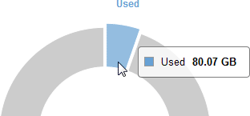

= 監控整個網格的儲存容量
:allow-uri-read: 
:icons: font
:imagesdir: ../media/

[role="lead"]
您必須監控網格的整體儲存容量、以確保有足夠的可用空間可供物件資料和物件中繼資料使用。瞭解隨著時間而改變的儲存容量、有助於您在使用網格的可用儲存容量之前、計畫新增儲存節點或儲存磁碟區。

.您需要的產品
您必須使用支援的瀏覽器登入Grid Manager。

.關於這項工作
Grid Manager中的儀表板可讓您快速評估整個網格和每個資料中心可用的儲存容量。「節點」頁面提供更詳細的物件資料和物件中繼資料值。

.步驟
. 評估整個網格和每個資料中心可用的儲存容量。
+
.. 選擇*儀表板*。
.. 在「Available Storage（可用儲存設備）」面板中、記下可用和已用儲存容量的整體摘要。
+

NOTE: 摘要不包括歸檔媒體。

+
image::../media/grid_manager_dashboard_cropped.png[Grid Manager儀表板]

.. 將游標放在圖表的「可用容量」或「已用容量」區段上、以查看可用或使用的空間大小。
+

.. 若為多站台網格、請檢閱每個資料中心的圖表。
.. 按一下圖表圖示 image:../media/icon_chart_new.gif["圖表圖示"] 針對整體圖表或個別資料中心、檢視一段時間內容量使用量的圖表。
+
顯示使用儲存容量百分比（%）與時間。

. 判斷已使用多少儲存設備、以及物件資料和物件中繼資料的可用儲存容量。
+
.. 選擇*節點*。
.. 選擇「*網格_*>*儲存設備*」。
+
image::../media/nodes_deployment_storage_tab.png[節點部署儲存索引標籤]

.. 將游標暫留在「已使用的儲存設備-物件資料」和「已使用的儲存設備-物件中繼資料」圖表上、即可查看整個網格可用的物件儲存設備和物件中繼資料儲存設備數量、以及隨著時間推移所使用的儲存設備數量。
+

NOTE: 站台或網格的總值不包含至少五分鐘未報告度量的節點、例如離線節點。

. 依照技術支援部門的指示、檢視網格儲存容量的其他詳細資料。
+
.. 選取*支援*>*工具*>*網格拓撲*。
.. 選擇「*網格_*>*總覽*>*主要*」。
+
image::../media/system_wide_storage_capacity.gif[全系統儲存容量：Grid拓撲樹狀結構]

. 計畫在使用網格可用儲存容量之前、先執行擴充以新增儲存節點或儲存磁碟區。
+
規劃擴充的時間時、請考量購買和安裝額外儲存設備所需的時間。

+

NOTE: 如果您的ILM原則使用銷毀編碼、當現有的儲存節點已滿約70%時、您可能會偏好擴充、以減少必須新增的節點數量。

+
如需規劃儲存擴充的詳細資訊、請參閱《擴充StorageGRID 指令》。

.相關資訊
link:../expand/index.html["擴充網格"]
