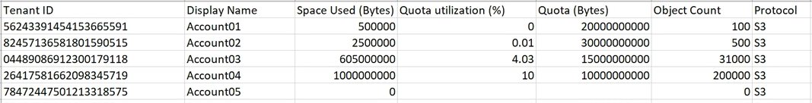

= 監控租戶活動
:allow-uri-read: 
:icons: font
:imagesdir: ../media/

[role="lead"]
所有用戶端活動都與租戶帳戶相關聯。您可以使用Grid Manager來監控租戶的儲存使用量或網路流量、也可以使用稽核記錄或Grafana儀表板來收集租戶使用StorageGRID 率的詳細資訊。

.您需要的產品
* 您必須使用支援的瀏覽器登入Grid Manager。
* 您必須具有「根存取」或「系統管理員」權限。

.關於這項工作

IMPORTANT: 「已用空間」值為預估值。這些預估值會受到擷取時間、網路連線能力和節點狀態的影響。

.步驟
. 選取*租戶*以檢閱所有租戶使用的儲存容量。
+
每個租戶都會列出已使用空間、配額使用率、配額和物件計數。如果未為租戶設定配額、則配額使用率欄位會包含破折號（-）、而配額欄位則會顯示「'Unlimited.'」。

+
image::../media/tenant_accounts_page.png[租戶帳戶頁面]

+
如果您的系統包含20個以上的項目、您可以指定一次在每個頁面上顯示的列數。使用搜尋方塊、依顯示名稱或租戶ID搜尋租戶帳戶。

+
您可以選取表格*登入*欄中的連結來登入租戶帳戶。

. （可選）選擇*匯出至CSV*以檢視及匯出內含所有租戶使用值的.csv*檔案。
+
系統會提示您開啟或儲存 `.csv` 檔案：

+
CSV檔案的內容如下所示：

+

+
您可以在試算表應用程式中開啟.csv檔案、或在自動化中使用。

. 若要檢視特定租戶的詳細資料（包括使用量圖表）、請從「租戶帳戶」頁面中選取租戶帳戶、然後選取*檢視詳細資料*。
+
此時會出現「帳戶詳細資料」頁面、顯示摘要資訊、代表已使用及剩餘配額量的圖表、以及代表貯體（S3）或Container（Swift）中物件資料量的圖表。

+
image::../media/tenant_usage_modal.png[租戶使用模式]

+
** *配額*
+
如果為此租戶設定配額、則「*配額*」圖表會顯示此租戶使用的配額數量、以及可用的配額數量。如果未設定配額、則租戶具有無限配額、並會顯示資訊訊息。如果租戶超過儲存配額1%以上、而且至少1 GB、則圖表會顯示總配額和超額金額。

+
您可以將游標放在「已使用空間」區段上、以查看已儲存物件的數量和使用的總位元組數。您可以將游標放在「可用空間」區段上、以查看可用的儲存配額位元組數。

+

IMPORTANT: 配額使用率是根據內部預估、在某些情況下可能會超過。例如StorageGRID 、當租戶開始上傳物件時、會檢查配額、如果租戶超過配額、則會拒絕新的擷取。不過StorageGRID 、判斷是否超過配額時、不考慮目前上傳的大小。如果刪除物件、則在重新計算配額使用率之前、租戶可能會暫時無法上傳新物件。配額使用率計算可能需要10分鐘或更長時間。

+

NOTE: 租戶的配額使用率表示租戶上傳至StorageGRID 物件資料的總數量（邏輯大小）。配額使用率不代表用來儲存這些物件複本及其中繼資料（實體大小）的空間。

+

NOTE: 您可以啟用*租戶配額使用量高*警示、以判斷租戶是否正在使用配額。如果啟用、當租戶使用90%的配額時、就會觸發此警示。如需詳細資訊、請參閱警示參考資料。

** *已用空間*
+
「桶*使用空間」（S3）或「容器*使用空間」（Swift）圖表顯示租戶最大的貯體。「已用空間」是指儲存區中的物件資料總量。此值不代表ILM複本和物件中繼資料所需的儲存空間。

+
如果租戶擁有九個以上的貯體或容器、則會將其合併成一個稱為「其他」的區段。有些圖表區段可能太小、無法包含標籤。您可以將游標放在任何區段上、以查看標籤並取得更多資訊、包括每個儲存區段或容器的儲存物件數和總位元組數。

+
image::../media/tenant_dashboard_storage_usage_segment_other.png[儲存使用量區段-其他]

. 選取*庫位詳細資料*（S3）或*容器詳細資料*（Swift）、即可檢視每個租戶桶或容器的已使用空間和物件數量清單。
+
image::../media/tenant_bucket_details.png[租戶庫存箱詳細資料]

. （可選）選擇*匯出至CSV*以檢視及匯出內含每個儲存區或容器使用值的.csv*檔案。
+
系統會提示您開啟或儲存.csf檔案。

+
個別S3租戶的.csv檔案內容如下所示：

+
image::../media/tenant_bucket_details_csv.png[租戶桶詳細資料CSV範例]

+
您可以在試算表應用程式中開啟.csv檔案、或在自動化中使用。

. 如果租戶已制定流量分類原則、請檢閱該租戶的網路流量。
+
.. 選擇*組態*>*網路設定*>*流量分類*。
+
「流量分類原則」頁面隨即出現、表中會列出現有的原則。

+
image::../media/traffic_classification_policies_main_screen_w_examples.png[圖表的流量原則範例]

.. 檢閱原則清單、找出適用於特定租戶的原則。
.. 若要檢視與原則相關的度量、請選取原則左側的選項按鈕、然後按一下* Metrics *。
.. 分析圖表、判斷原則限制流量的頻率、以及是否需要調整原則。
+
若要建立、編輯或刪除交通路況分類原則、請參閱《管理StorageGRID 》介紹。

. 您也可以選擇使用稽核日誌來更精細地監控租戶的活動。
+
例如、您可以監控下列類型的資訊：

+
** 特定的用戶端作業、例如PUT、Get或DELETE
** 物件大小
** 套用至物件的ILM規則
** 用戶端要求的來源IP

+
稽核記錄會寫入文字檔、您可以使用所選的記錄分析工具進行分析。這可讓您更深入瞭解客戶活動、或實作精密的計費與計費模式。如需詳細資訊、請參閱瞭解稽核訊息的指示。

. 您也可以使用Prometheus指標來報告租戶活動：
+
** 在Grid Manager中、選取* Support *>* Tools *>* Metrics *。您可以使用現有的儀表板（例如S3 Overview）來檢閱用戶端活動。
+

IMPORTANT: 「指標」頁面上提供的工具主要供技術支援使用。這些工具中的某些功能和功能表項目是刻意無法運作的。

** 選取*「說明*」>「* API說明文件*」。您可以使用Grid Management API的「度量」區段中的度量、為租戶活動建立自訂警示規則和儀表板。

.相關資訊
link:alerts-reference.html["警示參考資料"]

link:../audit/index.html["檢閱稽核記錄"]

link:../admin/index.html["管理StorageGRID"]

link:reviewing-support-metrics.html["檢閱支援指標"]
