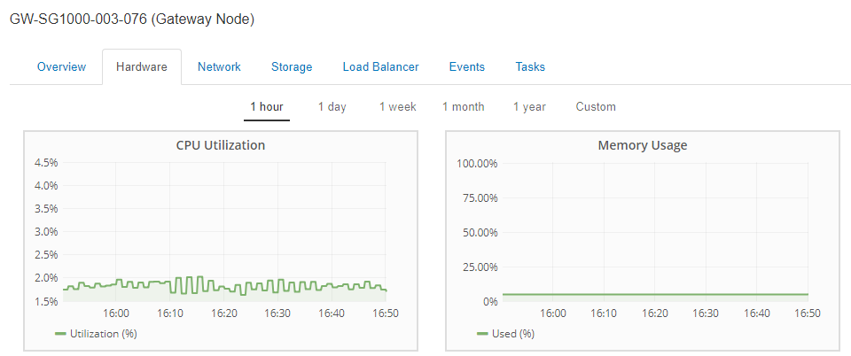
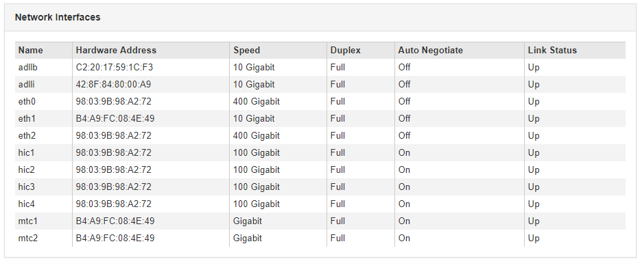

= 檢視應用裝置管理節點和閘道節點的相關資訊
:allow-uri-read: 
:icons: font
:imagesdir: ../media/

[role="lead"]
「節點」頁面會列出服務健全狀況的相關資訊、以及用於管理節點或閘道節點之每個服務應用裝置的所有運算、磁碟裝置和網路資源。您也可以看到記憶體、儲存硬體、網路資源、網路介面、網路位址、 以及接收和傳輸資料。

.步驟
. 從「節點」頁面、選取應用裝置管理節點或應用裝置閘道節點。
. 選擇*總覽*。
+
「概觀」索引標籤上的「節點資訊」表會顯示節點的ID和名稱、節點類型、安裝的軟體版本、以及與節點相關聯的IP位址。介面欄包含介面的名稱、如下所示：

+
** * adllb*和* adlli*：顯示管理網路介面是否使用主動/備份連結
** * eth*：網格網路、管理網路或用戶端網路。
** * hic*：設備上的實體10、25或100 GbE連接埠之一。這些連接埠可連結在一起、並連接StorageGRID 至「資訊網」（eth0）和「用戶端網路」（eth2）。
** * MTC*：應用裝置上的實體1 GbE連接埠之一、可連結或別名、並連線StorageGRID 至《The支援管理員網路》（eth1）。image:../media/nodes_page_overview_tab_services_appliance.png["服務應用裝置的節點頁面總覽索引標籤"]

. 選取*硬體*以查看有關應用裝置的詳細資訊。
+
.. 檢視CPU使用率和記憶體圖表、以判斷CPU和記憶體使用率的百分比。若要顯示不同的時間間隔、請選取圖表或圖表上方的其中一個控制項。您可以顯示1小時、1天、1週或1個月的可用時間間隔資訊。您也可以設定自訂時間間隔、以便指定日期和時間範圍。
+

.. 向下捲動以檢視應用裝置的元件表。此表包含機型名稱、序號、控制器韌體版本、以及每個元件的狀態等資訊。
+
image::../media/nodes_page_hardware_tab_services_appliance_do_not_use.png[服務應用裝置的「節點」頁面「硬體」索引標籤]

+
|===
| 欄位 | 說明 

 a| 
應用裝置機型
 a| 
此產品的型號StorageGRID 。

 a| 
儲存控制器故障磁碟機計數
 a| 
不是最佳的磁碟機數量。

 a| 
儲存資料磁碟機類型
 a| 
設備中的磁碟機類型、例如HDD（硬碟機）或SSD（固態磁碟機）。

 a| 
儲存資料磁碟機大小
 a| 
包括應用裝置中所有資料磁碟機在內的總容量。

 a| 
儲存RAID模式
 a| 
應用裝置的RAID模式。

 a| 
整體電源供應器
 a| 
產品中所有電源供應器的狀態。

 a| 
運算控制器BMC IP
 a| 
運算控制器中基礎板管理控制器（BMC）連接埠的IP位址。您可以使用此IP連線至BMC介面、以監控及診斷應用裝置硬體。

若設備機型不含BMC、則不會顯示此欄位。

 a| 
運算控制器序號
 a| 
運算控制器的序號。

 a| 
運算硬體
 a| 
運算控制器硬體的狀態。

 a| 
運算控制器CPU溫度
 a| 
運算控制器CPU的溫度狀態。

 a| 
運算控制器機箱溫度
 a| 
運算控制器的溫度狀態。

|===
.. 確認所有狀態均為「名義」。
+
如果狀態不是「名義」、請檢閱任何目前的警示。

. 選取*網路*以檢視每個網路的資訊。
+
網路流量圖表提供整體網路流量的摘要。

+
image::../media/nodes_page_network_traffic_graph.gif[節點頁面網路流量圖]

+
.. 請參閱「網路介面」一節。
+

+
下表與「網路介面」表格中* Speed*欄位的值一起使用、以判斷應用裝置上的四個40/100-GbE網路連接埠是否設定為使用主動/備份模式或LACP模式。

+

NOTE: 表中顯示的值假設使用了全部四個連結。

+
|===
| 連結模式 | 債券模式 | 個別HIC連結速度（hic1、hic2、hic3、hic4） | 預期網格/用戶端網路速度（eth0、eth2） 

 a| 
Aggregate
 a| 
LACP
 a| 
100
 a| 
400

 a| 
固定
 a| 
LACP
 a| 
100
 a| 
200

 a| 
固定
 a| 
使用中/備份
 a| 
100
 a| 
100

 a| 
Aggregate
 a| 
LACP
 a| 
40
 a| 
160

 a| 
固定
 a| 
LACP
 a| 
40
 a| 
80

 a| 
固定
 a| 
使用中/備份
 a| 
40
 a| 
40

|===
.. 請參閱「網路通訊」一節。
+
「接收和傳輸」表格顯示已在每個網路上接收和傳送多少位元組和封包、以及其他接收和傳輸度量。

+
image::../media/nodes_page_network_communication.gif[節點頁面網路通訊]

. 選取* Storage *以檢視服務應用裝置上磁碟裝置和磁碟區的相關資訊。
+
image::../media/nodes_page_storage_tab_services_appliance.png[節點頁面儲存索引標籤服務設備]

.相關資訊
link:../sg100-1000/index.html["SG100  機；SG1000服務應用裝置"]
