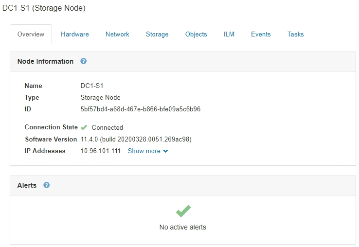
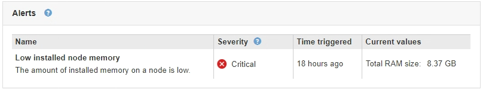

= 檢視「總覽」索引標籤
:allow-uri-read: 
:icons: font
:imagesdir: ../media/

[role="lead"]
「總覽」索引標籤提供每個節點的基本資訊。也會顯示目前影響節點的任何警示。

「總覽」索引標籤會顯示所有節點。

== 節點資訊

「概觀」索引標籤的「節點資訊」區段會列出有關網格節點的基本資訊。

節點的總覽資訊包括下列項目：

* *名稱*：指派給節點並顯示在Grid Manager中的主機名稱。
* *類型*：節點類型-管理節點、儲存節點、閘道節點或歸檔節點。
* * ID*：節點的唯一識別碼、也稱為UUID。
* *連線狀態*：三種狀態之一。此時會顯示最嚴重狀態的圖示。
+
** *未連線-未知* image:../media/icon_alarm_blue_unknown.png["藍色問號圖示"]：節點由於不明原因而未連線至網格。例如、節點之間的網路連線中斷或電源中斷。也可能會觸發*無法與node*通訊警示。其他警示也可能處於作用中狀態。這種情況需要立即注意。
+

NOTE: 在託管關機作業期間、節點可能會顯示為「未知」。在這些情況下、您可以忽略「未知」狀態。

** *未連線-管理性關機* image:../media/icon_alarm_gray_administratively_down.png["灰色問號圖示"]：由於預期原因、節點未連線至網格。例如、節點或節點上的服務已正常關機、節點正在重新開機、或軟體正在升級。一個或多個警示也可能處於作用中狀態。
** *已連線* image:../media/icon_alert_green_checkmark.png["圖示警示綠色勾選標記"]：節點已連接至網格。

* *軟體版本*：StorageGRID 安裝在節點上的版本。
* * HA Groups *：僅適用於管理節點和閘道節點。顯示節點上的網路介面是否包含在高可用度群組中、以及該介面是主介面還是備份介面。
+
image::../media/ha_group_master_interface.png[HA群組主要介面]

* * IP位址*：節點的IP位址。按一下*顯示更多*以檢視節點的IPv6位址和介面對應：
+
** eth0：網格網路
** eth1：管理網路
** eth2：用戶端網路

== 警示

「總覽」索引標籤的「警示」區段會列出目前影響此節點且尚未靜音的任何警示。按一下警示名稱以檢視其他詳細資料和建議的動作。

.相關資訊
link:monitoring-node-connection-states.html["監控節點連線狀態"]

link:viewing-current-alerts.html["檢視目前警示"]

link:viewing-specific-alert.html["檢視特定警示"]
