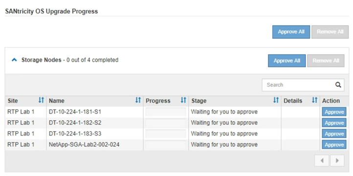
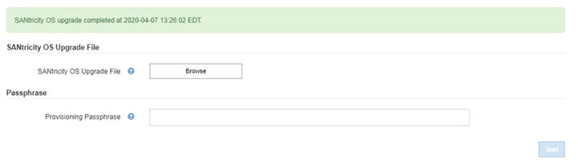

= 使用Grid Manager在SANtricity 儲存控制器上升級作業系統
:allow-uri-read: 
:icons: font
:imagesdir: ../media/

[role="lead"]
使用Grid Manager來套用SANtricity 作業系統升級。

.您需要的產品
* 您已諮詢NetApp互通性對照表工具IMT （NetApp Interoperability Matrix Tool、簡稱「參考資訊」）、確認SANtricity 您用於升級的作業系統版本與您的應用裝置相容。
* 您必須具有維護權限。
* 您必須使用支援的瀏覽器登入Grid Manager。
* 您必須擁有資源配置通關密碼。
* 您必須能夠存取NetApp的SANtricity 《關於不支援的作業系統的下載頁面」。

.關於這項工作
您必須先完成更新程序、才能執行其他軟體更新StorageGRID （更新版的資訊、更新版或修補程式）SANtricity 。如果您在StorageGRID 完成更新程序之前嘗試啟動修補程式或更新版的功能、SANtricity 您會被重新導向SANtricity 到「更新版更新版」頁面。

在所有適用的節點上成功套用完更新版的作業系統之前、此程序將不會完成SANtricity 。在SANtricity 每個節點上載入該作業系統可能需要30分鐘以上、並可能需要90分鐘才能重新啟動每StorageGRID 個效益儲存應用裝置。

CAUTION: 下列步驟僅適用於使用Grid Manager執行升級的情況。

NOTE: 此程序會自動將NVSRAM升級 至SANtricity 與更新版有關的最新版本。您不需要套用個別的NVSRAM升級 檔案。

.步驟
. 從服務型筆記型電腦下載SANtricity 全新的作業系統更新檔NetApp 支援網站 、請從The支援網站的支援網站下載。
+
請務必為SANtricity E2700儲存控制器選擇支援的作業系統版本。

. 使用支援的瀏覽器登入Grid Manager。
. 選擇*維護*。然後在功能表的「System（系統）」區段中、選取「* Software Update *（*軟體更新*）」。
+
此時會出現「軟體更新」頁面。

+
image::../media/software_update_landing.png[軟體更新登陸頁面]

. 按一下* SANtricity 《作業系統》*。
+
畫面上會出現「支援作業系統」頁面SANtricity 。

+
image::../media/santricity_os_upgrade_first.png[顯示StorageGRID 「第一個SANtricity 畫面」的快照]

. 選取您從 NetApp 支援網站下載的 SANtricity 作業系統升級檔案。
+
.. 按一下*瀏覽*。
.. 找出並選取檔案。
.. 按一下「*開啟*」。
+
檔案已上傳並驗證。驗證程序完成後、檔案名稱會顯示在詳細資料欄位中。

+

NOTE: 請勿變更檔案名稱、因為它是驗證程序的一部分。

+
image::../media/santricity_upgrade_os_file_validated.png[作業系統升級有效檔案SANtricity]

. 輸入資源配置通關密碼。
+
* Start*（開始*）按鈕已啟用。

+
image::../media/santricity_start_button.png[顯示StorageGRID 「第一個SANtricity 畫面」的快照]

. 按一下* Start*。
+
此時會出現一個警告方塊、指出當重新啟動升級的節點上的服務時、瀏覽器的連線可能會暫時中斷。

+
image::../media/santricity_upgrade_warning.png[顯示連線將暫時中斷對話方塊的快照]

. 按一下「*確定*」、將SANtricity 作業系統升級檔案登入主管理節點。
+
當作業系統升級開始時SANtricity ：

+
.. 執行健全狀況檢查。此程序會檢查沒有節點的狀態是否為「Needs Attention（需要注意）」。
+

NOTE: 如果報告了任何錯誤、請解決這些錯誤、然後再按一下「* Start*（開始*）」。

.. 畫面會出現「更新作業系統」進度表。SANtricity此表顯示網格中的所有儲存節點、以及每個節點的目前升級階段。
+

NOTE: 下表顯示所有儲存節點、包括軟體型儲存節點。您必須核准所有儲存節點的升級、即使SANtricity 升級版不影響軟體型儲存節點。針對軟體型儲存節點傳回的升級訊息為「SANtricity 不適用於此節點的作業系統升級」。

+

. 或者、您也可以根據*站台*、*名稱*、*進度*、*階段*或*詳細資料*、以遞增或遞減順序排序節點清單。或者、在*搜尋*方塊中輸入詞彙、以搜尋特定節點。
+
您可以使用區段右下角的左右箭頭捲動節點清單。

. 核准已準備好新增至升級佇列的網格節點。相同類型的核准節點一次升級一個。
+

IMPORTANT: 除非SANtricity 您確定節點已準備好停止並重新開機、否則請勿核准應用裝置儲存節點的更新版。SANtricity 當節點上核准升級版作業系統時、該節點上的服務將會停止。之後、當節點升級時、會重新啟動應用裝置節點。這些作業可能會造成與節點通訊的用戶端服務中斷。

+
** 按一下「*全部核准*」按鈕之一、將所有儲存節點新增SANtricity 至「支援作業系統」升級佇列。
+

NOTE: 如果節點升級順序很重要、請一次核准一個節點或節點群組、並等到每個節點上的升級完成後、再核准下一個節點。

** 按一下一或多個*核准*按鈕、將一個或多個節點新增SANtricity 至「支援作業系統」升級佇列。
+

NOTE: 您可能會延遲將SANtricity 某個版本的作業系統升級至節點、但SANtricity 除非您核准SANtricity 所有列出的儲存節點上的更新版、否則無法完成該版本的作業系統升級程序。

+
按一下* Approve *之後、升級程序會決定是否可以升級節點。如果節點可以升級、則會將其新增至升級佇列。+

+
對於某些節點、所選的升級檔案並非刻意套用、您可以在不升級這些特定節點的情況下完成升級程序。對於刻意未升級的節點、此程序會在「詳細資料」欄位中顯示完成階段、並顯示下列其中一則訊息：+

+
*** 儲存節點已升級。
*** 不適用於此節點的作業系統升級SANtricity 。
*** 作業系統檔案與此節點不相容SANtricity 。

+
「SANtricity 不適用於此節點的作業系統升級」訊息表示節點沒有StorageGRID 可由支援此功能的儲存控制器。非應用裝置儲存節點將會顯示此訊息。您無需SANtricity 升級顯示此訊息的節點、即可完成更新作業系統的程序。+出現「SANtricity '不盡 相同的作業系統檔案與此節點不相容」訊息、表示節點需要SANtricity 的是不同於程序嘗試安裝的作業系統檔案。完成目前SANtricity 的更新版作業系統之後、請下載SANtricity 適用於該節點的更新版作業系統、然後重複執行升級程序。

. 如果您需要從SANtricity 「支援作業系統」升級佇列中移除節點或所有節點、請按一下「*移除*」或「*全部移除*」。
+
如範例所示、當階段超出佇列時、「*移除*」按鈕會隱藏、您無法再將節點移除SANtricity 到「支援服務」升級程序中。

+
image::../media/approve_all_progresstable.png[「更新移除」按鈕SANtricity]

. 請稍候SANtricity 、將更新版套用至每個核准的網格節點。
+

IMPORTANT: 如果SANtricity 任何節點在套用更新版的過程中顯示錯誤階段、表示該節點的升級失敗。設備可能需要置於維護模式、才能從故障中恢復。請先聯絡技術支援人員再繼續。

+
如果節點上的韌體太舊、無法使用Grid Manager進行升級、節點會顯示錯誤階段、並顯示詳細資料：「您必須使用維護模式來升級SANtricity 此節點上的作業系統。請參閱設備的安裝與維護說明。升級之後、您可以使用此公用程式進行後續升級。」 若要解決此錯誤、請執行下列步驟：

+
.. 在SANtricity 顯示錯誤階段的節點上、使用維護模式來升級支援的作業系統。
.. 使用Grid Manager重新啟動並完成SANtricity 還原OS升級。
+
當所有核准節點上的更新均完成時、將會關閉「更新作業系統」進度表、並會出現綠色橫幅、顯示完成更新作業系統的日期和時間。SANtricity SANtricity SANtricity

+

. 對於需要不同SANtricity 的更新檔的任何節點、請重複此升級程序。
+

NOTE: 對於狀態為「Needs Attention（需要注意）」的任何節點、請使用維護模式來執行升級。

.相關資訊
link:upgrading-santricity-os-on-e2700-controller-using-maintenance-mode.html["使用SANtricity 維護模式升級E2700控制器上的作業系統"]
