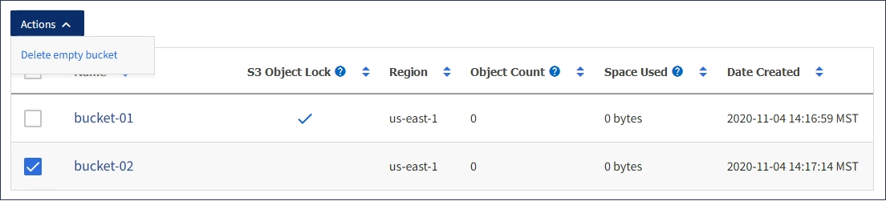

= 刪除S3儲存區
:allow-uri-read: 
:icons: font
:imagesdir: ../media/

[role="lead"]
您可以使用租戶管理程式刪除空的S3儲存區。

.您需要的產品
* 您必須使用支援的瀏覽器登入租戶管理程式。
* 您必須屬於具有「管理所有庫位」或「根存取」權限的使用者群組。這些權限會覆寫群組或儲存區原則中的權限設定。

.關於這項工作
這些指示說明如何使用租戶管理程式刪除S3儲存區。您也可以使用租戶管理API或S3 REST API來刪除S3桶。

如果S3儲存區包含物件或非目前物件版本、則無法刪除。如需如何刪除S3版本控制物件的相關資訊、請參閱資訊生命週期管理物件的管理指示。

.步驟
. 選擇*儲存設備（S3）*>*桶*。
+
此時會顯示「庫位」頁面、並顯示所有現有的S3庫位。

+
image::../media/buckets_table.png[鏟斗表]

. 選取您要刪除之空白儲存格的核取方塊。
+
「動作」功能表已啟用。

. 從「動作」功能表中、選取*「刪除空桶」*。
+

+
隨即顯示確認訊息。

+
image::../media/delete_bucket_confirmation_dialog.png[刪除儲段確認對話方塊]

. 如果確定要刪除此儲存區、請選取*刪除儲存區*。
+
確認儲存區已空、然後刪除儲存區StorageGRID 。此作業可能需要幾分鐘的時間。

+
如果儲存區不是空的、就會出現錯誤訊息。您必須先刪除所有物件、才能刪除儲存區。

+
image::../media/delete_bucket_not_empty_message.png[刪除時段非空白訊息]

.相關資訊
link:../ilm/index.html["使用ILM管理物件"]
