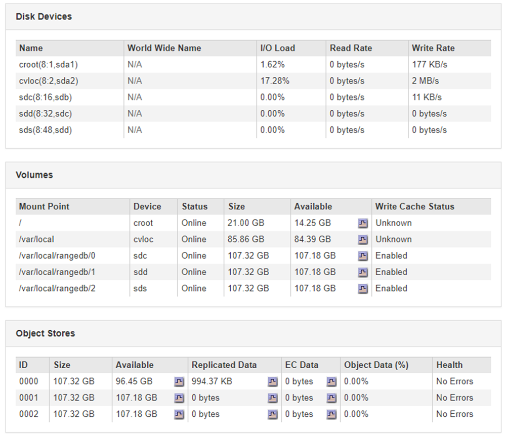

= 疑難排解物件與儲存問題
:allow-uri-read: 
:icons: font
:imagesdir: ../media/

[role="lead"]
您可以執行多項工作、以協助判斷物件和儲存問題的來源。

== 確認物件資料位置

視問題而定、您可能需要確認物件資料的儲存位置。例如、您可能想要驗證ILM原則是否如預期般執行、而且物件資料是否儲存在預期的位置。

.您需要的產品
* 您必須擁有物件識別碼、可以是：
+
** * UUID *：物件的通用唯一識別碼。輸入全部大寫的UUID。
** * CBID*：StorageGRID 物件在功能區內的唯一識別碼。您可以從稽核記錄取得物件的CBID。輸入全大寫的CBID。
** * S3儲存區和物件金鑰*：透過S3介面擷取物件時、用戶端應用程式會使用儲存區和物件金鑰組合來儲存和識別物件。
** * Swift Container和物件名稱*：透過Swift介面擷取物件時、用戶端應用程式會使用容器和物件名稱組合來儲存和識別物件。

.步驟
. 選取* ILM *>*物件中繼資料查詢*。
. 在*識別碼*欄位中輸入物件的識別碼。
+
您可以輸入UUID、CBID、S3儲存區/物件金鑰、或Swift容器/物件名稱。

+
image::../media/object_lookup.png[物件查詢頁面]

. 按一下*查詢*。
+
隨即顯示物件中繼資料查詢結果。本頁列出下列資訊類型：

+
** 系統中繼資料、包括物件ID（UUID）、物件名稱、容器名稱、租戶帳戶名稱或ID、物件的邏輯大小、第一次建立物件的日期和時間、以及上次修改物件的日期和時間。
** 任何與物件相關聯的自訂使用者中繼資料金鑰值配對。
** 對於S3物件、任何與物件相關聯的物件標記金鑰值配對。
** 對於複寫的物件複本、每個複本的目前儲存位置。
** 對於以銷毀編碼的物件複本、每個片段的目前儲存位置。
** 對於Cloud Storage Pool中的物件複本、物件的位置、包括外部儲存區名稱和物件的唯一識別碼。
** 對於分段物件和多部分物件、包含區段識別碼和資料大小的物件區段清單。對於超過100個區段的物件、只會顯示前100個區段。
** 所有物件中繼資料均採用未處理的內部儲存格式。此原始中繼資料包含內部系統中繼資料、無法保證從發行到發行都會持續存在。
+
下列範例顯示儲存為兩個複寫複本之S3測試物件的物件中繼資料查詢結果。

+
image::../media/object_lookup_results.png[物件查詢結果]

.相關資訊
link:../ilm/index.html["使用ILM管理物件"]

link:../s3/index.html["使用S3"]

link:../swift/index.html["使用Swift"]

== 物件存放區（儲存磁碟區）故障

儲存節點上的基礎儲存設備分為物件存放區。這些物件存放區是實體分割區、可做StorageGRID 為適用於整個系統儲存設備的掛載點。物件存放區也稱為儲存磁碟區。

您可以檢視每個儲存節點的物件存放區資訊。物件存放區顯示在「*節點*>*儲存節點_*>*儲存設備*」頁面底部。

若要查看每個儲存節點的詳細資料、請依照下列步驟操作：

. 選取*支援*>*工具*>*網格拓撲*。
. 選擇*站台_*>*儲存節點_*>*儲存設備*>*總覽*>*主要*。

image::../media/storage_node_object_stores.png[儲存節點物件存放區]

視故障性質而定、儲存磁碟區的故障可能會反映在儲存狀態或物件存放區健全狀況的警示中。如果儲存磁碟區故障、您應該修復故障的儲存磁碟區、以便儘快將儲存節點還原為完整功能。如有必要、您可以前往*組態*索引標籤、將儲存節點置於唯讀狀態、StorageGRID 以便在準備完整還原伺服器的同時、讓該系統可用於資料擷取。

.相關資訊
link:../maintain/index.html["維護"]
