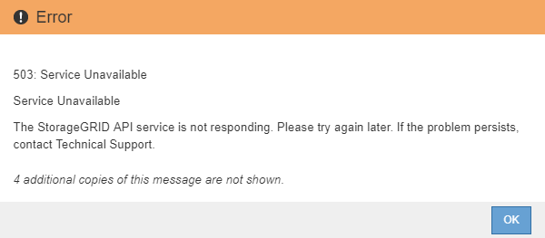

= 開始升級
:allow-uri-read: 
:icons: font
:imagesdir: ../media/

[role="lead"]
當您準備好執行升級時、請選取下載的檔案、然後輸入資源配置通關密碼。您可以選擇在執行實際升級之前執行升級前置檢查。

.您需要的產品
您已檢閱所有考量事項、並完成中的所有步驟 link:upgrade-planning-and-preparation.html["升級規劃與準備"]。

.步驟
. 使用支援的瀏覽器登入Grid Manager。
. 選擇*維護*>*系統*>*軟體更新*。
+
此時會出現「軟體更新」頁面。

. 選擇* StorageGRID 《Upgrade》*。
+
「更新版」頁面會出現、並顯示最近完成升級的日期和時間、除非主管理節點已重新開機、或管理API在執行升級後重新啟動StorageGRID 。

. 選取 `.upgrade` 您下載的檔案。
+
.. 選擇*瀏覽*。
.. 找出並選取檔案： `NetApp_StorageGRID_version_Software_uniqueID.upgrade`
.. 選取*「Open*（開啟*）」。
+
檔案已上傳並驗證。驗證程序完成後、升級檔案名稱旁會出現綠色勾號。

. 在文字方塊中輸入資源配置通關密碼。
+
*執行預先檢查*和*開始升級*按鈕會啟用。

+
image::../media/storagegrid_upgrade_buttons_enabled.png[支援的更新按鈕StorageGRID]

. 如果您想在開始實際升級之前驗證系統的狀況、請選取*執行預先檢查*。然後、解決所報告的任何預先檢查錯誤。
+

IMPORTANT: 如果您已開啟任何自訂防火牆連接埠、系統會在預先檢查驗證期間通知您。您必須先聯絡技術支援部門、才能繼續升級。

+

NOTE: 當您選取*開始升級*時、也會執行相同的預先檢查。選取*執行預先檢查*可讓您在開始升級之前偵測並解決問題。

. 當您準備好執行升級時、請選取*開始升級*。
+
此時會出現一則警告、提醒您當主要管理節點重新開機時、瀏覽器的連線將會中斷。當主要管理節點再次可用時、您需要清除網頁瀏覽器的快取、然後重新載入「軟體升級」頁面。

+
image::../media/software_upgrade_connection_will_be_lost.png[軟體升級連線將會中斷]

. 選擇*確定*以確認警告並開始升級程序。
+
升級開始時：

+
.. 升級預先檢查會執行。
+

NOTE: 如果報告任何預先檢查錯誤、請解決這些錯誤、然後再次選取*開始升級*。

.. 主管理節點已升級、包括停止服務、升級軟體及重新啟動服務。當主要管理節點正在升級時、您將無法存取Grid Manager。稽核記錄也無法使用。此升級可能需要30分鐘。
+

NOTE: 當主要管理節點正在升級時、會出現多個下列錯誤訊息複本、您可以忽略這些訊息。

+
image::../media/software_upgrade_problem_connecting_error.png[軟體升級問題連線錯誤]

+

+
image::../media/software_upgrade_400_error.png[軟體升級400錯誤]

. 升級主要管理節點之後、請清除網頁瀏覽器的快取、重新登入、然後重新載入「軟體升級」頁面。
+
如需相關指示、請參閱網頁瀏覽器的說明文件。

+

IMPORTANT: 您必須清除網頁瀏覽器的快取、才能移除舊版軟體所使用的過時資源。

.相關資訊
link:upgrade-planning-and-preparation.html["升級規劃與準備"]
