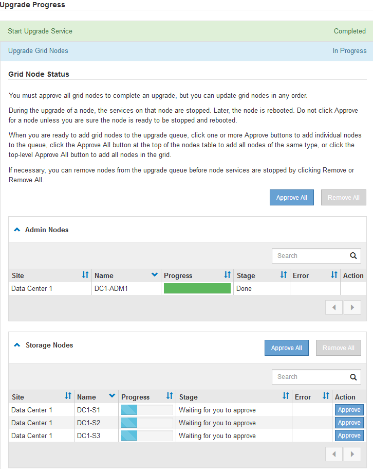
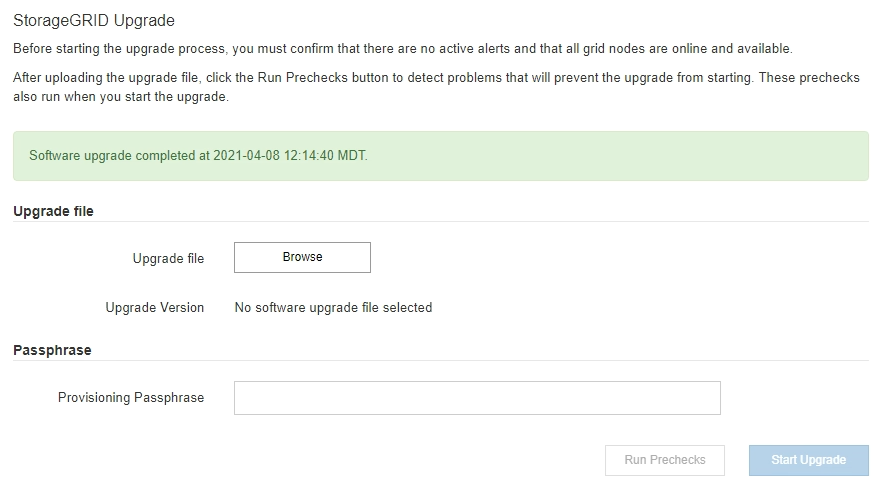

= 升級網格節點並完成升級
:allow-uri-read: 
:icons: font
:imagesdir: ../media/

[role="lead"]
升級主管理節點之後、您必須升級StorageGRID 您的整個作業系統中的所有其他網格節點。您可以選擇升級個別網格節點、網格節點群組或所有網格節點、以自訂升級順序。

.步驟
. 檢閱「軟體升級」頁面上的「升級進度」區段、其中提供每項重大升級工作的相關資訊。
+
.. *「開始升級服務」*是第一項升級工作。在此工作期間、軟體檔案會發佈至網格節點、並啟動升級服務。
.. 當*開始升級服務*工作完成時、*升級網格節點*工作就會啟動。
.. 當*升級網格節點*工作進行中時、網格節點狀態表會出現、並顯示系統中每個網格節點的升級階段。

. 網格節點出現在「Grid Node Status（網格節點狀態）」表格中之後、但在核准任何網格節點之前、請下載新的恢復套件複本。
+

IMPORTANT: 在主管理節點上升級軟體版本之後、您必須下載新的恢復套件檔案複本。恢復套件檔案可讓您在發生故障時還原系統。

. 檢閱網格節點狀態表中的資訊。網格節點會依類型分成多個區段：管理節點、API閘道節點、儲存節點和歸檔節點。
+

+
當第一次顯示此頁面時、網格節點可以處於下列其中一個階段：

+
** 完成（僅限主要管理節點）
** 正在準備升級
** 軟體下載排入佇列
** 正在下載
** 正在等待您核准

. 核准已準備好新增至升級佇列的網格節點。相同類型的核准節點一次升級一個。
+
如果節點升級順序很重要、請一次核准一個節點或節點群組、並等到每個節點上的升級完成後、再核准下一個節點或節點群組。

+

IMPORTANT: 在網格節點上開始升級時、該節點上的服務會停止。之後、網格節點會重新開機。這些作業可能會造成與節點通訊的用戶端服務中斷。除非確定節點已準備好停止並重新開機、否則請勿核准節點的升級。

+
** 選取一或多個*核准*按鈕、將一個或多個個別節點新增至升級佇列。
** 選取每個區段中的*「核准全部*」按鈕、將同類型的所有節點新增至升級佇列。
** 選取「頂層*全部核准*」按鈕、將網格中的所有節點新增至升級佇列。

. 如果需要從升級佇列中移除節點或所有節點、請選取*移除*或*全部移除*。
+
如範例所示、當登臺達到*停止服務*時、*移除*按鈕會隱藏、您無法再移除節點。

+
image::../media/software_upgrade_two_nodes_queued.gif[顯示「分級」正在停止服務的螢幕擷取畫面]

. 等待每個節點繼續執行升級階段、包括佇列、停止服務、停止容器、清除Docker映像、升級基礎OS套件、重新開機和啟動服務。
+

NOTE: 當應用裝置節點達到「升級基礎作業系統套件」階段時、StorageGRID 應用裝置上的《支援應用程式安裝程式軟體」將會更新。此自動化程序可確保StorageGRID SynsanceAppliance Installer版本與StorageGRID 支援的更新版本保持同步。

+
當所有網格節點均已升級時、*升級網格節點*工作會顯示為「已完成」。其餘的升級工作會在背景中自動執行。

. 一旦*啟用功能*工作完成（很快就會發生）、您就可以開始使用升級StorageGRID 版的更新版更新功能。
+
例如、如果您要升級StorageGRID 至5.2、現在可以啟用S3物件鎖定、設定金鑰管理伺服器、或是增加中繼資料保留空間設定。

+
link:increasing-metadata-reserved-space-setting.html["增加中繼資料保留空間設定"]

. 定期監控*升級資料庫*工作的進度。
+
在此工作期間、Cassandra資料庫會在每個儲存節點上進行升級。

+

NOTE: 「*升級資料庫*」工作可能需要數天才能完成。執行此背景工作時、您可以套用即時修復程式或還原節點。不過、您必須等待*最終升級步驟*工作完成、才能執行擴充或取消委任程序。

+
您可以檢閱圖表來監控每個儲存節點的進度。

+
image::../media/software_upgrade_upgrade_database.png[軟體升級升級資料庫]

. 當*升級資料庫*工作完成時、請等待幾分鐘、*最終升級步驟*工作才會完成。
+
image::../media/software_upgrade_final_upgrade_steps.png[最終升級步驟]

+
完成「最終升級步驟」工作後、即會完成升級。

. 確認升級成功完成。
+
.. 使用支援的瀏覽器登入Grid Manager。
.. 選取*「說明」**「關於」*。
.. 確認顯示的版本符合您的期望。
.. 選擇*維護*>*系統*>*軟體更新*。然後選擇* StorageGRID 《Upgrade》*。
.. 確認綠色橫幅顯示軟體升級已在您預期的日期和時間完成。
+

. 確認網格作業已恢復正常：
+
.. 檢查服務是否正常運作、以及是否沒有非預期的警示。
.. 確認用戶端連線StorageGRID 至該系統的運作正常。

. 請查看NetApp下載頁StorageGRID 面以瞭解是否有任何適用於StorageGRID 您剛安裝之版本的修補程式可供使用。
+
https://["NetApp下載StorageGRID"^]

+
在《S17 11.5._x.y_版本號碼：StorageGRID

+
** 主要版本的_x_值為0（11.5.0）。
** 次要版本的_x_值若有、則為0以外的值（例如11.5.1）。
** 如果有可用的熱修復程式、則會有_y_值（例如11.5.0.1）。

. 如果有、請下載並套用StorageGRID 適用於您的更新版本的最新修補程式。
+
如需套用修補程式的相關資訊、請參閱還原與維護指示。

.相關資訊
link:downloading-recovery-package.html["正在下載恢復套件"]

link:../maintain/index.html["維護"]
